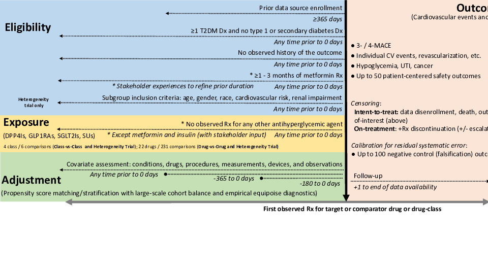

```{r setup, include=FALSE}
knitr::opts_chunk$set(echo = TRUE)
options(kableExtra.latex.load_packages = FALSE)
library(kableExtra)
#knitr::knit_hooks$set(document = function(x) {sub('\\usepackage[]{color}', '\\usepackage[table]{xcolor}', x, fixed = TRUE)})
library(dplyr)
options(knitr.kable.NA = "")

pdf2png <- function(path) {
  # only do the conversion for non-LaTeX output
  if (knitr::is_latex_output()) {
    return(path)
  }
  path2 <- xfun::with_ext(path, "png")
  img <- magick::image_read_pdf(path)
  magick::image_write(img, path2, format = "png")
  path2
}


latex_table_font_size <- 8
```

# List of Abbreviations

```{r abbreviations, echo=FALSE}
abbreviations <- readr::read_delim(col_names = FALSE, delim = ";", trim_ws = TRUE, file = "
  CDM; Common data model
  DPP4; Dipeptidyl peptidase-4 
  GLP1; Glucagon-like peptide-1
  IRB; Institutional review board
  LEGEND; Large-scale Evidence Generation and Evaluation across a Network of Databases
  MDRR; Minimum detectable risk ratio
  OHDSI; Observational Health Data Science and Informatics
  OMOP; Observational Medical Outcomes Partnership
  PS; Propensity score
  RCT; Randomized controlled trial
  SGLT2; Sodium-glucose co-transporter-2
  T2DM; Type 2 diabetes mellitus
")

tab <- kable(abbreviations, col.names = NULL, linesep = "", booktabs = TRUE)

if (knitr::is_latex_output()) {
  tab %>% kable_styling(latex_options = "striped", font_size = latex_table_font_size)
} else {
  tab %>% kable_styling(bootstrap_options = "striped")
}
```

# Responsible Parties

## Investigators

```{r parties, echo=FALSE}
parties <- readr::read_delim(col_names = TRUE, delim = ";", trim_ws = TRUE, file = "
  Investigator; Institution/Affiliation
  George Hripcsak; Department of Biomedical Informatics, Columbia University, New York, NY, USA
  Harlan M. Krumholz; Department of Medicine, Yale University, New Haven, CT, USA
  Patrick B. Ryan; Observational Health Data Analytics, Janssen Research and Development, Titusville, NJ, USA
  Martijn J. Schuemie; Observational Health Data Analytics, Janssen Research and Development, Titusville, NJ, USA
  Marc A. Suchard *; Department of Biostatistics, University of California, Los Angeles, Los Angeles, CA, USA
")

tab <- kable(parties, booktabs = TRUE, linesep = "") %>% 
  column_spec(1, width = "10em") %>%
  column_spec(2, width = "30em") %>%
  footnote(general = "* Principal Investigator", general_title = "")

if (knitr::is_latex_output()) {
  tab %>% kable_styling(latex_options = "striped", font_size = latex_table_font_size)
} else {
  tab %>% kable_styling(bootstrap_options = "striped")
}
```

## Disclosures

This study is undertaken within Observational Health Data Sciences and Informatics (OHDSI), an open collaboration.
**GH** receives grant funding from the US National Institutes of Health and the US Food & Drug Administration and contracts from Janssen Research and Development.
**PBR** and **MJS** are employees of Janssen Research and Development and shareholders in John & Johnson.
**MAS** receives grant funding from the US National Institutes of Health and the US Food & Drug Administration and contracts from Janssen Research and Development and IQVIA.

# Abstract

**Background and Significance**: Type 2 diabetes mellitus (T2DM) is a major cause of morbidity and mortality globally and is associated with an elevated risk of cardiovascular events.
Therapeutic options for T2DM have expanded over the last decade with the emergence of sodium-glucose co-transporter-2 (SGLT2) inhibitors and glucagon-like peptide-1 (GLP1) receptor agonists, which reduced the risk of major cardiovascular events in randomized controlled trials (RCTs).
Cardiovascular evidence for older second-line agents, such as sulfonylureas, and direct head-to-head comparisons, including with dipeptidyl peptidase 4 (DPP4) inhibitors, are lacking, leaving a critical gap in our understanding of the relative effects of T2DM agents on cardiovascular risk and on patient-centered safety outcomes.

**Study Aims**: To determine real-world comparative effectiveness and safety of traditionally second-line T2DM agents using health information encompassing millions of patients with T2DM, with a focus on individuals at moderate cardiovascular risk and other key subgroups.

**Study Description**: We will conduct three large-scale, systematic, observational studies to make pairwise comparisons of all SGLT2 inhibitor, GLP1 receptor agonist, DPP4 inhibitor and sulfonylurea agents at the drug-, class- and population subgroup-level within our proposed Large-Scale Evidence Generations Across a Network of Databases for T2DM (LEGEND-T2DM) initiative.
LEGEND-T2DM will leverage the Observational Health Data Science and Informatics (OHDSI) community that provides access to a standing global network of administrative claims and electronic health record (EHR) data sources.
The 13 data sources already committed to LEGEND-T2DM cover $>$ 190 million patients in the US and about 50 million internationally, and include two academic medical centers, IBM MarketScan and Optum databases, and the US Department of Veterans Affairs.
LEGEND-T2DM will study:

* **Population**: Adult, T2DM patients who newly initiate a traditionally second-line T2DM agent, including individuals with and without established cardiovascular disease 

Preliminary work in our data sources reveals > 1 million such new-users of SGLT2 inhibitors, GLP1 receptor agonists, DPP4 inhibitors or sulfonylureas with no prior, observed use of other second-line agents to best emulate the idealized RCT one would aim to run if it were practical, to compare: 

* **Comparators**:
  - SGLT2 inhibitors: canagliflozin, dapagliflozin, empagliflozin, ertugliflozin
  - GLP1 receptor agonists: albiglutide, dulaglutide, exenatide, liraglutide, lixisenatide, semaglutide
  - DPP4 inhibitors: alogliptin, linagliptin, saxagliptin, sitagliptin, vildagliptin
  - Sulfonylureas: chlorpropamide, glimepiride, glipizide, gliquidone, glyburide, tolazamide, tolbutamide
 
LEGEND-T2DM will execute allpairwise class-vs-class and drug-vs-drug comparisons in each data source that meet a minimum patient count of 1,000 per arm and extensive study diagnostics that assess reliability and generalizability through cohort balance and equipoise to examine the relative risk of cardiovascular and safety outcomes:

* **Outcomes**:
  - Primary: 3- and 4-point major adverse cardiovascular events
  - Secondary effectiveness: Acute myocardial infarction, acute renal failure, glycemic control, hospitalization for heart failure, measured renal dysfunction, stroke, sudden cardiac death
  - Secondary safety: Abnormal weight gain or loss, acute pancreatitis, bladder cancer, diabetic ketoacidosis, genitourinary infection, diarrhea, nausea or vomiting, edema, hypoglycemia, hypotension, joint pain, lower extremity amputation, thyroid tumor, and up to 28 additional stakeholder-guided drug side-effects

For each data source and comparison, LEGEND-T2DM will employ a state-of-the-art design:

* **Design**: Observational: active-comparator, new-user cohort study

and committed LEGEND-T2DM data sources provide:

* **Timeframe**: Up to 6- (SGLT2 inhibitors) to 20- (sulfonylureas) year follow-up for all outcomes

Our systematic framework will address residual confounding, publication bias and $p$-hacking using data-driven, large-scale propensity adjustment for measured confounding, a large set of negative control outcome experiments to address unmeasured and systematic bias, prespecification and full disclosure of hypotheses tested and their results. These approaches capitalize on mature OHDSI open source resources and a large body of clinical and quantitative research that the LEGEND-T2DM investigators originated and continue to drive.
Finally, LEGEND-T2DM is dedicated to open science and transparency and will publicly share all our analytic code from reproducible cohort definitions through turn-key software, enabling other research groups to leverage our methods, data, and results in order to verify and extend our findings.

# Amendments and Updates

```{r amendments, echo=FALSE}
amendments <- readr::read_delim(col_names = TRUE, delim = ";", trim_ws = TRUE, file = "
  Number; Date; Section of study protocol; Amendment or update; Reason
  None;;;; 
")

tab <- kable(amendments, booktabs = TRUE, linesep = "")

if (knitr::is_latex_output()) {
  tab %>% kable_styling(latex_options = "striped", font_size = latex_table_font_size)
} else {
  tab %>% kable_styling(bootstrap_options = "striped")
}
```

# Milestones

```{r dates, echo=FALSE}
dates <- readr::read_delim(col_names = TRUE, delim = ";", trim_ws = TRUE, file = "
  Milestone; Planned / actual date
  EU PAS Registration; 
  Start of analysis;
  End of analysis;
  Results presentation;
")

tab <- kable(dates, booktabs = TRUE, linesep = "") 

if (knitr::is_latex_output()) {
  tab %>% kable_styling(latex_options = "striped", font_size = latex_table_font_size)
} else {
  tab %>% kable_styling(bootstrap_options = "striped")
}
```

# Rationale and Background

The landscape of therapeutic options for type 2 diabetes mellitus (T2DM) has been dramatically transformed over the last decade [@Lo2018-ca].
The emergence of drugs targeting the sodium-glucose co-transporter-2 (SGLT2) and the glucagon-like peptide-1 (GLP1) receptor has expanded the role of T2DM agents from lowering blood glucose to directly reducing cardiovascular risk [@North2019-xn].
A series of large randomized clinical trials designed to evaluate the cardiovascular safety of SGLT2 inhibitors and GLP1 receptor agonists found that use of many of these agents led to a reduction in major adverse cardiovascular events, including myocardial infarction, hospitalization for heart failure, and cardiovascular mortality [@Zinman2015-ps; @Neal2017-gs; @Marso2016-zg; @Marso2016-yk].
However, other T2DM drugs widely used before the introduction of these novel agents, such as sulfonylureas, did not undergo similarly comprehensive trials to evaluate their cardiovascular efficacy or safety.
Moreover, direct comparisons of newer agents with dipeptidyl peptidase-4 (DPP4) inhibitors, with neutral effects on major cardiovascular outcomes [@Scirica2013-gl; @White2013-zl; @Green2015-pv; @Rosenstock2019-cp], have not been conducted. 
Nevertheless, DPP4 inhibitors and sulfonylureas continue to be used in clinical practice and are recommended as second line T2DM agents in national clinical practice guidelines.

Several challenges remain in formulating T2DM treatment recommendations based on existing evidence [@Cefalu2018-mu].
First, trials of novel agents did not pursue head-to-head comparisons to older agents and were instead designed as additive treatments on the background of commonly used T2DM agents.
Therefore, the relative cardiovascular efficacy and safety of novel compared with older agents is not known.
Second, trials of novel agents have tested individual drugs against placebo, but have not directly compared SGLT2 inhibitors with GLP1 receptor agonists in reducing adverse cardiovascular event risk.
Moreover, there is no evidence to guide the use of individual drugs within each class and across different drug classes, particularly among patients at lower cardiovascular risk than recruited in clinical trials.
Third, randomized trials focused on cardiovascular efficacy and safety, but were not powered to adequately assess the safety of these agents across a spectrum of non-cardiovascular outcomes.
Finally, restricted enrollment across regions, and subgroups of age, sex, and race further limits the efficacy and safety assessment that may guide individual patients’ treatment.

Evidence gaps from these trials also pose a challenge in designing treatment algorithms, which rely on comparative effectiveness and safety of drugs.
Perhaps, as a result, there is large variation in clinical practice guidelines and in clinical practice with regard to these medications, with many patients initiated on the newer therapies and many others treated with older regimens [@McCoy2019-hu; @Curtis2018-zg; @Arnold2017-fo; @Dave2020-ql; @Le2020-lh].
Among the second-line options, there is much variation with respect to the order of drugs used.
This lack of consensus about the best approach provides an opportunity for systematic, large-scale observational studies. 

# Study Objectives

To inform critical decisions facing patients with diabetes, their caregivers, clinicians, policymakers and healthcare system leaders, we have launched the Large-Scale Evidence Generation and Evaluation across a Network of Databases for Diabetes (LEGEND-T2DM) initiative to execute a series of comprehensive observational studies to compare cardiovascular outcome rates and safety of second-line T2DM glucose-lowering agents. Specifically, these studies aim

1. To determine, through systematic evaluation, the comparative effectiveness of traditionally second-line T2DM agents, SGLT2 inhibitors and GLP1 receptor agonists, with each other and with DPP4 inhibitors and sulfonylureas, for cardiovascular outcomes.
2. To determine, through systematic evaluation, the comparative safety of traditionally second-line T2DM agents among patients with T2DM.
3. To assess heterogeneity in effectiveness and safety of traditionally second-line T2DM agents among key patient subgroups: Using stratified patient cohorts, we will quantify differential effectiveness and safety across subgroups of patients based on age, sex, race, renal impairment, and baseline cardiovascular risk.  

# Research Methods

LEGEND-T2DM will execute three systematic, large-scale observational studies of second-line T2DM agents to estimate the relative risks of cardiovascular effectiveness and safety outcomes.

1. The **Class-vs-Class Study** will provide all pairwise comparisons between the four major T2DM agent classes to evaluate their comparative effects on cardiovascular risk  (Objective 1) and patient-centered safety outcomes (Objective 2);  
2. The **Drug-vs-Drug Study** will furnish head-to-head pairwise comparisons between individual agents within and across classes (both Ovjectives 1 and 2); and 
3. The **Heterogeneity Study** will refine these comparisons for T2DM patients for important subgroups (Objective 3).   
In contrast to a single comparison approach, LEGEND-T2DM will provide a comprehensive view of the findings and their consistency across populations, drugs, and outcomes.
We will model each study on our successful collaborative research evaluating the comparative effectiveness of antihypertensives recently published in _The Lancet_ [@Suchard2019-gq].

Table \@ref(tab:drug-table) list the four major T2DM agent classes and the individual agents licensed in the U.S. within each class.
We will examine all $4 \choose 2 = 6$ class-wise comparisons and all $5 + 6 + 4 + 7 \choose 2 = 231$ ingredient-wise comparisons.

For each comparison, we are interested in the relative risk of each of the cardiovascular and safety outcomes listed in Table \@ref(tab:outcome-table).

```{r drug-table, echo=FALSE}
exposures <- read.csv(system.file("settings/ExposuresOfInterest.csv", package = "LegendT2dm"))
classes <- exposures %>% filter(type == "Drug") %>% select(class) %>% pull() %>% unique()
tmp <- sapply(classes, function(single_class) {
  as.vector(exposures %>% filter(type == "Drug", class == single_class) %>% select(name) %>% pull())
})

n.obs <- sapply(tmp, length)
seq.max <- seq_len(max(n.obs))
drugs_by_class <- data.frame(sapply(tmp, "[", i = seq.max))
names(drugs_by_class) <- c("DPP4 inhibitors", "GLP1 receptor antagonists", "SGLT2 inhibitors", "Sulfonylureas")

tab <- kable(drugs_by_class, booktabs = TRUE, linesep = "",
             caption = "T2DM drug classes and individual agents within each class") %>% 
  kable_styling(bootstrap_options = "striped", latex_options = c("striped","hold_position"))

if (knitr::is_latex_output()) {
  tab %>%
    column_spec(1, width = "8em") %>%
    column_spec(2, width = "8em") %>%
    column_spec(3, width = "8em") %>%
    column_spec(4, width = "8em") %>%
    kable_styling(font_size = latex_table_font_size)
} else {
  tab
}
```

```{r outcome-table, echo=FALSE}

```

## Study Design

For each study, we will employ an active comparator, new-user cohort design [@Yoshida2015-ln; @Ryan2013-wq; @Schuemie2020-wx].
New-user cohort design is advocated as the primary design to be considered for comparative effectiveness and drug safety [@Schneeweiss2010-my; @Gagne2012-at; @Johnson2013-db].
By identifying patients who start a new treatment course and using therapy initiation as the start of follow-up, the new-user design models an randomized controlled trial (RCT) where treatment commences at the index study visit.
Exploiting such an index date allows a clear separation of baseline patient characteristics that occur prior to index date and are usable as covariates in the analysis without concern of inadvertently introducing mediator variables that arise between exposure and outcome [@Schneeweiss2007-am]. 
Excluding prevalent users as those without a sufficient washout period prior to first exposure occurrence further reduces bias due to balancing mediators on the causal pathway, time-varying hazards, and depletion of susceptibles.
[@Johnson2013-db; @Suissa2017-lv]. 
Our systematic framework across studies further will address residual confounding, publication bias, and p-hacking using data-driven, large-scale propensity adjustment for measured confounding [@Tian2018-xy], a large set of negative control outcome experiments to address unmeasured and systematic bias
[@Schuemie2014-bv; @Schuemie2016-km; @Schuemie2018-hq], and full disclosure of hypotheses tested [@Schuemie2018-zi].
Figure \@ref(fig:study-schematic) illustrates our design for all studies that the following sections describe in more detail.

```{r study-schematic, echo=FALSE, message=FALSE, fig.align='center', fig.cap='Some cool caption', fig.pos='H'}
if (knitr::is_latex_output()) {
  knitr::include_graphics("StudySchematic.pdf")
} else {
  #img <- magick::image_read_pdf("StudySchematic.pdf")
  #magick::image_write(img, "StudySchematic.png", format = "png")
    
}
```

## Data Sources

We will execute LEGEND-T2DM as a series of OHDSI network studies.
All data partners within OHDSI are encouraged to participate voluntarily and can do so conveniently, because of the community's shared Observational Medical Outcomes Partnership (OMOP) common data model (CDM) and OHDSI tool-stack.
Many OHDSI community data partners have already committed to participate and we will recruit further data partners through OHDSI’s standard recruitment process, which includes protocol publication on OHDSI’s GitHub, an announcement in OHDSI’s research forum, presentation at the weekly OHDSI all-hands-on meeting and direct requests to data holders.

Table \@ref(tab:data-sources) lists the 13 already committed data sources for LEGEND-T2DM; these sources encompass a large variety of practice types and populations. 
For each data source, we report a brief description and size of the population it represents and its patient capture process and start date.
While the earliest patient capture begins in 1989 (CUIMC), the vast majority come from the mid-2000s to today, providing almost two decades of T2DM treatment coverage.
US populations include those commercially and publicly insured, enriched for older individuals (MDCR, VA), lower socioeconomic status (MDCD), and racially diverse (VA >20% Black or African American, CUIMC 8%).
The US data sources may capture the same patients across multiple sources.
Different views of the same patients are an advantage in capturing the diversity of real-world health events that patients experience.
Across CCAE (commercially insured), MCDR (Medicare)  and MCDC (Medicaid), we expect little overlap in terms of the same observations recorded at the same time for a patient; patients can flow between sources (e.g., a CCAE patient who retires can opt-in to become an MDCR patient), but the enrollment time periods stand distinct.
On the other hand, Optum, PanTher, OpenClaims, CUIMC and YNHHS may overlap in time with the other US data sources.
While it remains against licensing agreements to attempt to link patients between most data sources, Optum reports <20% overlap between their claims and EHR data sources that is reassuringly small.
All data sources will receive institutional review board approval or exemption for their participation before executing LEGEND-T2DM.

```{r data-sources, echo=FALSE, warning=FALSE}
data_sources <- readr::read_delim(col_names = TRUE, delim = ";", trim_ws = TRUE, file = "
  Data source ; Population ; Patients ; History ; Data capture process and short description
  IBM MarketScan Commercial Claims and Encounters (CCAE) ; Commercially insured, < 65 years ; 142M ; 2000 -- ; Adjudicated health insurance claims (e.g. inpatient, outpatient, and outpatient pharmacy)  from large employers and health plans who provide private healthcare coverage to employees, their spouses and dependents.
  IBM MarketScan Medicare Supplemental Database (MDCR)  ; Commercially insured, 65$+$ years ; 10M ; 2000 -- ; Adjudicated health insurance claims of retirees with primary or Medicare supplemental coverage through privately insured fee-for-service, point-of-service or capitated health plans.
  IBM MarketScan Multi-State Medicaid Database (MDCD) ; Medicaid enrollees, racially diverse ; 26M ; 2006 -- ; Adjudicated health insurance claims for Medicaid enrollees from multiple states and includes hospital discharge diagnoses, outpatient diagnoses and procedures, and outpatient pharmacy claims.
  IQVIA Open Claims (IOC) ; General ; 160M ; 2010 -- ; Pre-adjudicated claims at the anonymized patient-level collected from office-based physicians and specialists via office management software and clearinghouse switch sources for the purpose of reimbursement.
  Japan Medical Data Center (JMDC) ; Japan, general ; 5.5M ; 2005 -- ; Data from 60 society-managed health insurance plans covering workers aged 18 to 65 and their dependents.
  Korea National Health Insurance Service (NHIS) ; 2% random sample of South Korea ; 1M ; 2002 -- ; National administrative claims database covering the South Korean population.
  Optum Clinformatics Data Mart (Optum) ; Commercially or Medicare insured ; 85M ; 2000 -- ; Inpatient and outpatient healthcare insurance claims.
  Columbia University Irving Medical Center (CIUMC) ; Academic medical center patients, racially diverse ; 6M ; 1989 -- ; General practice, specialists and inpatient hospital services from the New York-Presbyterian hospital and affiliated academic physician practices in New York.
  Department of Veterans Affairs (VA) ; Veterans, older, racially diverse ; 12M ; 2000 -- ; National VA health care system, the largest integrated provider of medical services in the US, provided at 170 VA medical centers and 1,063 outpatient sites.
  Information System for Research in Primary Care (SIDIAP) ; 80% of all Catalonia (Spain) ; 7.7M ; 2006 -- ; Primary care partially linked to inpatient data with pharmacy dispensations and primary care laboratories.  Healthcare is universal and taxpayer funded in the region, and PCPs are gatekeeps for all care and responsible for repeat prescriptions. 
  IQVIA Disease Analyzer Germany (DAG) ; Germany, general ; 37M ; 1992 -- ; Collection from patient management software used by general practitioners and selected specialists to document patients’ medical records within their office-based practice during a visit.
  Optum Electronic Health Records (OptumEHR) ; US, general ; 93M ; 2006 -- ; Clinical information, prescriptions, lab results, vital signs, body measurements, diagnoses and procedures derived from clinical notes using natural language processing. 
  Yale New Haven Health System (YNHHS) ; Academic medical center patients ; 2M ; 2013 -- ; General practice, specialists and inpatient hospital services from the YNHHS in Connecticut.
")
tab <- kable(data_sources, booktabs = TRUE, linesep = "",
      caption = "Committed LEGEND-T2DM data sources and the populations they cover.") %>% 
  kable_styling(bootstrap_options = "striped", latex_options = "striped") %>%
  pack_rows("Administrative claims", 1, 7, latex_align = "c", indent = FALSE) %>%
  pack_rows("Electronic health records (EHRs)", 8, 13, latex_align = "c", indent = FALSE)

if (knitr::is_latex_output()) {
  tab %>%
    column_spec(1, width = "10em") %>%
    column_spec(2, width = "10em") %>%
    column_spec(5, width = "25em") %>%
    kable_styling(font_size = latex_table_font_size)
} else {
  tab
}
```

## Study Population

We will include all subjects in a data source who met inclusion criteria for one or more traditionally second-line T2DM agent exposure cohorts.
Broadly, these cohorts will consist of T2DM patients either with or without prior metformin monotherapy who now initiate treatment with one of the 22 drug ingredients that comprise the DPP4 inhibitor, GLP1 receptor agonist, SGT2 inhibitor and sulfonylurea drug classes (Table \@ref(tab:drug-table)).
We do not consider thiazolidinediones given their known risk association with heart failure and bladder cancer 
[@Graham2010-pg; @Turner2014-oq].
We describe specific definitions for exposure cohorts for each study in the following sections.

## Exposure Comparators

### Class-vs-Class Study comparisons {#class-v-class}
The **Class-vs-Class** Study will construct four exposure cohorts for new-users of any drug ingredient within the four traditionally second-line drug classes in Table \@ref(tab:drug-table).
Cohort entry (index date) for each patient is their first observed exposure to any drug ingredient for the four second-line drug classes.
Consistent with an idealized target trial for T2DM therapy and cardiovascular risk [@Hernan2016-ab; @Hernan2019-ie], inclusion criteria for patients based on the index date will include:

* T2DM diagnosis and no Type 1 or secondary diabetes mellitus diagnosis before the index date;
* At least 1 year of observation time before the index date (to improve new-user sensitivity); and
* No prior drug exposure to a comparator second-line or other antihyperglycemic agent (i.e. thiazolidinediones, acarbose, acetohexamide, bromocriptine, glibornuride, miglitol and nateglinide) or insulin before index date.

We will construct and compare separately cohorts patients either with

* At least 3 months of metformin use before the index date,    **TODO** We need to define this more specifically in the ATLAS cohort definitions

or

* No prior metformin use before the index date.

In the first case, three months of metformin is consistent with ADA guidelines [@American_Diabetes_Association2018-yz].
In the second case, we are interested in relative effectiveness and safety of these traditionally second-line agents in patients who iniative their treatments without first using metformin.
We purposefully do not automatically exclude patients with a history of myocardial infarction, stroke or other major cardiovascular events, which will allow us to report relative effectiveness and safety for individuals with both low or moderate and high cardiovascular risk. 
Likewise, we do not automatically exclude individuals with severe renal impairment [@Nathan2013-cu].
We will use cohort diagnostics, such as achieving covariate balance and clinical empirical equipoise between exposure cohorts (Section \@ref(section-todo)) and stakeholder input to guide the possible need to exclude other prior diagnoses, such as congestive heart failure, pancreatitis or cancer [@Nathan2013-cu].

#### TODO Add ATLAS description of exposure cohorts

We remain acutely aware that these inclusion criteria do not directly incorporate quantitative measures of poor glycemic control, such as one or more elevated serum HbA1c measurements; such laboratory values are irregularly captured in large claims and even EHR data sources. 
Older ADA guidelines (but not since 2020 for patients with cardiovascular  disease [@Association2020-ic]) advise escalating to a second-line agent only when glycemic control is not met with metformin monotherapy, nicely mirroring our cohort design for our historical data. 
We will conduct sensitivity analyses involving available HbA1c measurements to demonstrate their balance between exposure cohorts (described later in Section \@ref(section-todo)). 
In the unlikely event that balance is not met, we will consider an inclusion criterion of at least two HbA1c measurements $\ge$ 7% within 6 months before the index [@Hernan2019-ie].
We will also conduct sensitivity analyses to the prior insulin use exclusions, bearing in mind difficulties in assessing insulin use end-dates. 

For each data source, we will then execute all $2 \times {4 \choose 2} = 6$ pairwise class comparisons for which the data source yields $\ge$ 1,000 patients in each arm.
Significantly fewer numbers of patients strongly suggest data source-specific differences in prescribing practices that may introduce residual bias and sufficient samples sizes are required to construct effective propensity score models [@Schuemie_undated-rt, @Suchard2019-gq].

### Drug-vs-Drug Study comparisons {#drug-v-drug}

The **Drug-vs-Drug Study** will construct $2 \times 22$ exposure cohorts for new-users of each drug ingredient in Table \@ref(tab:drug-table).
We will apply the same cohort definition, inclusion criteria and patient count minimum as described in Section \@ref(class-v-class).

For each data source, we will then execute all $2 \times {22 \choose 2} = 462$ pairwise drug comparisons.
While we will publicly report studies results for all pairwise comparisons, we will focus primary clinical interpretation and scientific publishing to the $2 \times {5 \choose 2}$ [within DPP4Is] $+ 2 \times {6 \choose 2}$ [within GLPR1RAs] $+ 2 \times {4 \choose 2}$ [within SGLT2Is] $+ 2 \times {7 \choose 2}$ [within SUs] $= 104$ comparisons that pit drugs within the same class against each other, as well as across-class comparisons that stakeholders deem pertinent given their experiences.

#### TODO What are the relevant across-class drug-ingredient-level comparisons?


### Heterogeneity Study comparisons

The **Heterogeneity Study**  will further stratify all 237 class- and drug-level exposure cohorts in Sections \@ref(class-v-class) and \@ref(drug-v-drug) by clinically important patient characteristics that modify cardiovascular risk or relative treatment heterogeneity to provide patient-focused treatment recommendations.
These factors will include:

* Age (18 - 44 / 45 - 64 / $\ge$ 65 at the index date)
* Gender (women / men)
* Race (African American or black / white)
* Cardiovascular risk (low or moderate/high, via established cardiovascular disease at the index date)
* Renal impairment (at the index date)

We will define patients at high cardiovascular risk as those who fulfill at index date an established cardiovascular disease (CVD) definition that has been previously developed and validated for risk stratification among new-users of second-line T2DM agents [@Ryan2018-ci].
Under this definition, established CVD means having at least 1 diagnosis code for a condition indicating cardiovascular disease, such as arteriosclerotic vascular disease, cerebrovascular disease, ischemic heart disease or peripheral vascular disease, or having undergone at least 1 procedure indicating cardiovascular disease, such as percutaneous coronary intervention, coronary artery bypass graft or revascularization, any time on or prior to the exposure start.
Likewise, we will define renal impairment through diagnosis codes for chronic kidney disease and end-stage renal disease, dialysis procedures, and laboratory measurements of estimated glomerular filtration rate, serum creatinine and urine albumin.

#### TODO Need ATLAS definition for renal impairment

Appendix \@ref(atlas-subgroups) presents complete ATLAS specifications for these subgroups. **TODO**

### Validation

We will validate exposure cohorts and aggregate drug utilization using comprehensive cohort characterization tools against both claims and EHR data sources.
Chief among these tools stands OHDSI’s CohortDiagnostic package (**TODO** link to package).
For any cohort and data source mapped to OMOP CDM, this package systematically generates incidence new-user rates (stratified by age, gender, and calendar year), cohort characteristics (all comorbidities, drug use, procedures, health utilization) and the actual codes found in the data triggering the various rules in the cohort definitions.
This can allow researchers and stakeholders to understand the heterogeneity of source coding for exposures and health outcomes as well as the impact of various inclusion criteria on overall cohort counts (details described in Section D.7 \@ref(section-todo) **TODO**). 

## Outcomes

Across all data sources and pairwise exposure cohorts, we will assess relative risks of **TODO #** cardiovascular and patient-centered outcomes (Table \@ref(outcome-table)).
Primary outcomes of interest are: 

* 3-point major adverse cardiovascular events (MACE), including acute myocardial infarction, stroke, and sudden cardiac death, and
* 4-point MACE with the addition of heart failure hospitalization.  

Secondary outcomes include:

* individual MACE components, 
* acute renal failure, 
* revascularization 

In data sources with laboratory measurements, secondary outcomes further include:

* glycemic control, and 
* measured renal dysfunction  

We will also study second-line T2DM drug side-effects and safety concerns highlighted in the 2018 ADA guidelines [@American_Diabetes_Association2018-yz], including:

* abnormal weight change, 
* genitourinary (GU) infection, 
* various cancers, and 
* hypoglycemia 

While we list many patient-centered outcomes as "exploratory" in the table, we use this term to highlight those that are less likely to achieve high statistical power across all data sources due to lower event rates.
We will employ the same level of systematic rigor in studying outcomes regardless of their label. 

A majority of outcome definitions have been previously implemented and validated in our own work [@Suchard2019-gq; @You_undated-fz; @Ryan2018-ci; @Wang2017-su; @Weinstein2020-ic; @Yuan2018-am] based heavily on prior development by others (see references in Table \@ref(outcome-table)).
To assess across-source consistency and general clinical validity, we will characterize outcome incidence, stratified by age, sex and index year for each data source.  

```{r outcomes, echo=FALSE, warning=FALSE, results='asis'}
outcomes <- read.csv("OutcomeCohortTable.csv")

if (knitr::is_latex_output()) {
  convertCitationToLatex <- function(cite) {
    if (cite != "") {
      tmp <- substring(cite, 2, nchar(cite) - 1)
      citeList <- strsplit(tmp, ";")
      tmpList <- lapply(citeList, function(x) {
        substring(x, 2, nchar(x))
      })
      tags <- paste(unlist(tmpList), collapse = ",")
      cite <- paste("\\cite{", tags, "}", sep = "")
    }
    cite
  }
  outcomes$cite <- sapply(outcomes$cite, convertCitationToLatex)
}

tab <- kable(outcomes, booktabs = TRUE, linesep = "", escape = FALSE,
      caption = "Committed LEGEND-T2DM data sources and the populations they cover.") %>% 
  kable_styling(bootstrap_options = "striped", latex_options = "striped") 

if (knitr::is_latex_output()) {
  tab %>%
    column_spec(3, width = "25em") %>%
    column_spec(4, width = "10em") %>%
    kable_styling(font_size = latex_table_font_size)
} else {
  tab
}
```

### TODO: Additional outcomes

* Which additional outcomes from the table below from LEGEND-HTN are also relevant for T2DM?

```{r additional-oucomes, echo=FALSE, warning=FALSE}
htn_outcomes <- read.csv("LegendHtnTable.csv") %>% select(name)
htn_outcomes$columns <- rep(c(1,2,3,4), nrow(htn_outcomes))[1:nrow(htn_outcomes)]

add.col <- function(df, new.col) {
  n.row <- dim(df)[1]
  length(new.col) <- n.row
  cbind(df, new.col)
}

htn_outcomes <- data.frame(label1 = htn_outcomes %>% filter(columns == 1) %>% select(name) %>% pull()) %>%
  add.col(htn_outcomes %>% filter(columns == 2) %>% select(name) %>% pull()) %>%
  add.col(htn_outcomes %>% filter(columns == 3) %>% select(name) %>% pull()) %>%
  add.col(htn_outcomes %>% filter(columns == 4) %>% select(name) %>% pull())
names(htn_outcomes) <- c()

tab <- kable(htn_outcomes, booktabs = TRUE, linesep = "", longtable = TRUE,
      caption = "All LEGEND-HTN outcomes") %>%
  kable_styling(bootstrap_options = "striped", latex_options = "striped")
if (knitr::is_latex_output()) {
  tab %>%
    column_spec(1, width = "13em") %>%
    column_spec(2, width = "13em") %>%
    column_spec(3, width = "13em") %>%
    column_spec(4, width = "13em") %>%
    kable_styling(font_size = latex_table_font_size)
} else {
  tab
}
```

* Which additional outcomes from the table below from the PhenotypeLibrary are also relevant for T2DM?

```{r pl-outcomes, echo=FALSE, warning=FALSE}
pl_outcomes <- read.csv("PhenotypeLibraryDescriptions.csv") %>% select(phenotypeName)
pl_outcomes$columns <- rep(c(1,2,3,4), nrow(pl_outcomes))[1:nrow(pl_outcomes)]


pl_outcomes <- data.frame(label1 = pl_outcomes %>% filter(columns == 1) %>% select(phenotypeName) %>% pull()) %>%
  add.col(pl_outcomes %>% filter(columns == 2) %>% select(phenotypeName) %>% pull()) %>%
  add.col(pl_outcomes %>% filter(columns == 3) %>% select(phenotypeName) %>% pull()) %>%
  add.col(pl_outcomes %>% filter(columns == 4) %>% select(phenotypeName) %>% pull())

names(pl_outcomes) <- c()

tab <- kable(pl_outcomes, booktabs = TRUE, linesep = "", longtable = TRUE,
      caption = "All PhenotypeLibrary outcomes") %>%
  kable_styling(bootstrap_options = "striped", latex_options = "striped")
if (knitr::is_latex_output()) {
  tab %>%
    column_spec(1, width = "13em") %>%
    column_spec(2, width = "13em") %>%
    column_spec(3, width = "13em") %>%
    column_spec(4, width = "13em") %>%
    kable_styling(font_size = latex_table_font_size)
} else {
  tab
}
```

## Analysis

### Contemporary utilization of drug classes and individual agents

For all cohorts in the three studies, we will describe overall utilization as well as temporal trends in the use of each drug class and agents within the class. 
Further, we will evaluate these trends in patient groups by age (18-44 / 45-64 / $\ge$ 65 years), gender, race and geographic regions. 
Since the emergence of novel medications in the management of type 2 DM in 2014, there has been a rapid expansion in both the number of drug classes and individual agents.
These data will provide insight into the current patterns of use and possible disparities.
These data are critical to guide the real-world application of treatment decision pathways for the treatment of T2DM patients.

Specifically, we will calculate and validate aggregate drug utilization using the OHDSI’s CohortDiagnostic package against both claims and EHR data sources.
The CohortDiagnostics package works in two steps: 1) Generate the utilization results and diagnostics against a data source and 2) Explore the generated utilization and diagnostics in a user-friendly graphical interface R-Shiny app.
Through the interface, one can explore patient profiles of a random sample of subjects in a cohort.
These diagnostics provide a consistent methodology to evaluate cohort definitions/phenotype algorithms across a variety of observational databases.
This will enable researchers and stakeholders to become informed on the appropriateness of including specific data sources within analyses, exposing potential risks related to heterogeneity and variability in patient care delivery that, when not addressed in the design, could result in errors such as highly correlated covariates in propensity score matching of a target and a comparator cohort.
Thus, the added value of this approach is two-fold in terms of exposing data quality for a study question and ensuring face validity checks are performed on proposed covariates to be used for balancing propensity scores.

### Relative risk of cardiovascular and patient-centered outcomes

For all three studies, we will execute a systematic process to estimate the relative risk of cardiovascular and patient-centered outcomes between new-users of second-line T2DM agents.
The process will adjust for measured confounding, control from further residual (unmeasured) bias and accommodate important design choices to best emulate the nearly impossible to execute, idealized RCT that our stakeholders envision across data source populations, comparators, outcomes and subgroups.

To adjust for potential measured confounding and improve the balance between cohorts, we will build large-scale propensity score (PS) models [@Rosenbaum1983-cd] for each pairwise comparison and data source using a consistent data-driven process through regularized regression [@Tian2018-xy].
This process engineers a large set of predefined baseline patient characteristics, including age, gender, race, index month/year and other demographics and prior conditions, drug exposures, procedures, laboratory measurements and health service utilization behaviors, to provide the most accurate prediction of treatment and balance patient cohorts across many characteristics.
Construction of condition, drug, procedures and observations include occurrences within 365, 180 and 30 days prior to index date and are aggregated at several SNOMED (conditions) and ingredient/ATC class (drugs) levels.
Other demographic measures include comorbidity risk scores (Charlson, DCSI, CHADS2, CHAD2VASc).
From prior work, feature counts have ranged in the 1,000s - 10,000s, and these large-scale PS models have outperformed hdPS [@Schneeweiss2009-im] in simulation and real-world examples [@Tian2018-xy].

We will:

* Exclude patients who have experienced the outcome prior to their index date,
* Stratify and variable-ratio match patients by PS, and 
* Use (conditional) Cox proportional hazards models 

to estimate hazard ratios (HRs) between alternative target and comparator treatments for the risk of each outcome in each data source.
The regression will condition on the PS strata/matching-unit with treatment allocation as the sole explanatory variable and censor patients at the end of their time-at-risk (TAR) or data source observation period.
We will prefer stratification over matching if both sufficiently balance patients (see **TODO**), as the former optimizes patient inclusions and thus generalizability.

We will execute each comparison using three different TAR definitions, reflecting different and important causal contrasts:

* Intent-to-treat (TAR: index + 1 → end of observation) captures both direct treatment effects and (long-term) behavioral/treatment changes that initial assignment triggers [@Hernan2012-kz];
* On-treatment-1 (TAR: index + 1 → treatment discontinuation) is more patient-centered [@Murray2018-zf] and captures direct treatment effect while allowing for escalation with additional T2DM agents; and
* On-treatment-2 (TAR: index + 1 → discontinuation or escalation with T2DM agents) carries the least possible confounding with other concurrent T2DM agents.

Our "on-treatment" is often called "pre-protocol" [@Hernan2017-qp].
Systematically executing with multiple causal contrasts enables us to identify potential biases that missing prescription data, treatment escalation and behavioral changes introduce, while preserving the ease of intent-to-treat interpretation and power if the data demonstrate them as unbiased.

We will aggregate HR estimates across non-overlapping data sources to produce meta-analytic estimates using a random-effects meta-analysis [@DerSimonian1986-co].
This classic meta-analysis assumes that per-data source likelihoods are approximately normally distributed [@Gronsbell2020-sr].
This assumption fails when outcomes are rare as we expect for some safety events.
Here, our recent research shows that as the number of data sources increases, the non-normality effect increases to where coverage of 95% confidence intervals (CIs) can be as low as 5%.
To counter this, we will also apply a Bayesian meta-analysis model [@Higgins2009-cm; @schuemie2021combining] that neither assumes normality nor requires patient-level data sharing by building on composite likelihood methods [@Varin2011-gc] and enables us to introduce appropriate overlap weights between data sources.

Residual study bias from unmeasured and systematic sources often remains in observational studies even after controlling for measured confounding through PS-adjustment [@Schuemie2014-bv; @Schuemie2016-km].
For each comparison-outcome effect, we will conduct negative control (falsification) outcome experiments, where the null hypothesis of no effect is believed to be true, using approximately 100 controls identified through a data-rich algorithm [@Voss2017-nv] and validated in LEGEND-HTN [@Suchard2019-gq]. 
Using the empirical null distributions from these experiments, we will calibrate each study effect HR estimate, its 95% CI and the $p$-value to reject the null hypothesis of no differential effect [@Schuemie2018-hq].
We will declare an HR as significantly different from no effect when its calibrated $p < 0.05$ without correcting for multiple testing.
Finally, blinded to all trial results, study investigators will evaluate study diagnostics for all comparisons to assess if they were likely to yield unbiased estimates (Section \@ref{sample-size}).

### Sensitivity analyses and missingness

Because of the potential confounding effect of glycemic control at baseline between treatment choice and outcomes and to better understand the impact of limited glucose level measurements on effectiveness and safety estimation that arises in administrative claims and some EHR data, we will perform pre-specified sensitivity analyses for all studies within data sources that contain reliable glucose measurements.
Within a study, for each exposure pair, we will first rebuild PS models where we additionally include baseline glucose measurements as patient characteristics, stratify or match patients under the new PS models that directly adjust for potential glycemic confounding and then estimate effectiveness and safety HRs.  

Missing data of potential concern are patient demographics (gender, age, race)  for our inclusion criteria.
We will include only individuals whose baseline eligibility can be characterized that will most notably influence race subgroup assessments in the **Heterogeneity Study**.
No further missing data can arise in our large-scale PS models because all features, with the exception of demographics, simply indicate the presence or absence of health records in a given time-period.  Finally, we limit the impact of missing data, such as prescription information, relating to exposure time-at-risk by entertaining multiple definitions [@Schneeweiss2007-am].
In all reports, we will clearly tabulate numbers of missing observations and patient attrition.

# Sample Size and Study Power {#sample-size}

Within each data source, we will execute all comparisons with $\ge$ 1,000 eligible patients per arm.
Blinded to effect estimates, investigators and stakeholders will evaluate extensive study diagnostics for each comparison to assess reliability and generalizability, and only report risk estimates that pass [@Schuemie2018-zi; @Schuemie2020-he].
These diagnostics will include 

1. Minimum detectable risk ratio (MDRR) as a typical proxy for power, 
2. Preference score distributions to evaluate empirical equipoise10 and population generalizability, 
3. Extensive patient characteristics to evaluate cohort balance before and after PS-adjustment, 
4. Negative control calibration plots to assess residual bias, and 
5. Kaplan-Meier plots to examine hazard ratio proportionality assumptions.

We will define cohorts to stand in empirical equipoise if the majority of patients carry preference scores between 0.3 and 0.7 and to achieve balance if all after-adjustment characteristics return absolute standardized mean differences $<$ 0.1 [@Austin2009-af].

### TODO: Meta-analysis heterogeneity measures $i^2$. How does this apply to our total evidence approach?

# Strengths and Limitations

## Strengths
- Cohort studies allow direct estimation of incidence rates following exposure of interest, and the new-user design can capture early events following treatment exposures while avoiding confounding from previous treatment effects; new use allows for a clear exposure index date.
- Large-scale propensity score matching and stratification create balance on a large number of baseline potential confounders and have been found in the past to balance unmeasured confounders.
- Systematic processes including a pre-specified selection of covariates avoids investigator-specific biases in variable selection.
- Use of real negative and synthetic positive control outcomes provides an independent estimate of residual bias in the experiment.
- The fully specified study protocol is being published before analysis begins.
- Dissemination of the results will not depend on estimated effects, avoiding publication bias.
- All analytic methods have previously been verified on real data.
- All software is freely available as open source.
- Use of a common data model allows extension of the experiment to future databases and allows replication of these results on licensable databases that were used in this experiment, while still maintaining patient privacy on patient-level data.
- Use of multiple databases allows estimating consistency to add credibility and supports generalizability.

#### TODO: possible text to work in here 
 
For antihypertensives, we have successfully shown that adjustment via these models yielded balanced cohorts on all observed features (not just a handful of prespecified characteristics as is typical of many observational studies) and further balanced cohorts on blood pressure in data sources where these measurements were available, even though these measurements were not included in model building, hence providing some protection against unmeasured confounding as well.  This stands out as a major strength of LEGEND-T2DM, as direct observation of glycemic control is missing in some data sources. 

Ideal negative controls carry identical confounding between exposures and the outcome of interest.110 The true confounding structure, however, is unknowable.  Instead of attempting to find the elusive perfect negative control, we will rely on a large sample of controls that represent a wide range of confounding structures.  If a study comparison proves to be unbiased for all negative controls, we can feel confident that it will also be unbiased for the outcome of interest.  In our previous studies,23,24,111 using the active comparator, new-user cohort design we will employ here, we have observed minimal residual bias using negative controls.  This stands in stark contrast to other designs such as the (nested) case-control that tends to show large residual bias because of incomparable exposure cohorts implied by the design.32 
 
## Limitations
 
- Even though many potential confounders will be included in this study, there may be residual bias due to unmeasured or misspecified confounders, such as confounding by indication, differences in physician characteristics that may be associated with drug choice, concomitant use of other drugs started after the index date, and informative censoring at the end of the on-treatment periods. To minimize this risk, we used methods to detect residual bias through our negative and positive controls.
- Our follow-up times are limited and variable, potentially reducing power to detect differences in effectiveness and safety.
- We assume hazards are not time varying.
- Misclassification of study variables is unavoidable in secondary use of health data, so it is possible to misclassify treatments, covariates, and outcomes; we do not expect differential misclassification, so bias will most likely be towards the null.
- The electronic health record databases may be missing care episodes for patients due to care outside the respective health systems; bias will most likely be towards the null.

# Protection of Human Subjects

LEGEND-T2DM does not involve human subjects research.
The project does, however, use de-identified human data collected during routine healthcare provision.
All data partners executing the LEGEND-T2DM studies within their data sources will have received institutional review board (IRB) approval or waiver for participation in accordance to their institutional governance prior to execution (see Table ADD-REF).
LEGEND-T2DM executes across a federated and distributed data network, where analysis code is sent to participating data partners and only aggregate summary statistics are returned, with no sharing of patient-level data between organizations.

```{r irb, echo=FALSE}
data_sources <- readr::read_delim(col_names = TRUE, delim = "&", trim_ws = TRUE, file = "
Data source & Statement
IBM MarketScan Commercial Claims and Encounters (CCAE) & New England Institutional Review Board and was determined to be exempt from broad IRB approval, as this research project did not involve human subject research.
IBM MarketScan Medicare Supplemental Database (MDCR)  & New England Institutional Review Board and was determined to be exempt from broad IRB approval, as this research project did not involve human subject research.
IBM MarketScan Multi-State Medicaid Database (MDCD) & New England Institutional Review Board and was determined to be exempt from broad IRB approval, as this research project did not involve human subject research.
IQVIA Open Claims (IOC) & This is a retrospective database study on de-identified data and is deemed not human subject research. Approval is provided for OHDSI network studies.
Japan Medical Data Center (JMDC) & New England Institutional Review Board and was determined to be exempt from broad IRB approval, as this research project did not involve human subject research.
Korea National Health Insurance Service (NHIS) & Ajou University Institutional Review Board (AJIRB-MED-EXP-17-054 for LEGEND-HTN) and approval expected shortly for LEGEND-T2DM.
Optum Clinformatics Data Mart (Optum) & New England Institutional Review Board and was determined to be exempt from broad IRB approval, as this research project did not involve human subject research.
Columbia University Irving Medical Center (CIUMC) & Use of the CUIMC data source was approved by the Columbia University Institutional Review Board as an OHDSI network study (IRB\\# AAAO7805).
Department of Veterans Affairs (VA) & Use of the VA-OMOP data source was reviewed by the Department of Veterans Affairs Central Institutional Review Board (IRB) and was determined to meet the criteria for exemption under Exemption Category 4(3) and approved the request for Waiver of HIPAA Authorization.
Information System for Research in Primary Care (SIDIAP) & Use of the SIDIAP data source was approved by the Clinical Research Ethics Committee of IDIAPJGol (project code: 20/070-PCV)
IQVIA Disease Analyzer Germany (DAG) & This is a retrospective database study on de-identified data and is deemed not human subject research. Approval is provided for OHDSI network studies.
Optum Electronic Health Records (OptumEHR) & New England Institutional Review Board and was determined to be exempt from broad IRB approval, as this research project did not involve human subject research.
Yale New Haven Health System (YNHHS) & Use of the YNHHS EHR data source was approved by the Yale University Institutional Review Board as an OHDSI network study (IRB\\# pending).
")

tab <- kable(data_sources, booktabs = TRUE, linesep = "",
      caption = "IRB approval or waiver statement from partners.") %>% 
  kable_styling(bootstrap_options = "striped", latex_options = "striped")

if (knitr::is_latex_output()) {
  tab %>%
    column_spec(1, width = "15em") %>%
    column_spec(2, width = "40em") %>%
    kable_styling(font_size = latex_table_font_size)
} else {
  tab
}
```

# Management and Reporting of Adverse Events and Adverse Reactions

LEGEND-T2DM uses coded data that already exist in electronic databases.
In these types of databases, it is not possible to link (i.e., identify a potential causal association between) a particular product and medical event for any specific individual.
Thus, the minimum criteria for reporting an adverse event (i.e., identifiable patient, identifiable reporter, a suspect product and event) are not available and adverse events are not reportable as individual adverse event reports.
The study results will be assessed for medically important findings.

# Plans for Disseminating and Communicating Study Results

Open science aims to make scientific research, including its data process and software, and its dissemination, through publication and presentation, accessible to all levels of an inquiring society, amateur or professional [@Woelfle2011-ss] and is a governing principle of LEGEND-T2DM.
Open science delivers reproducible, transparent and reliable evidence.
All aspects of LEGEND-T2DM (except private patient data) will be open and we will actively encourage other interested researchers, clinicians and patients to participate.
This differs fundamentally from traditional studies that rarely open their analytic tools or share all result artifacts, and inform the community about hard-to-verify conclusions at completion.

## Transparent and re-usable research tools

We will publicly register this protocol and announce its availability for feedback from stakeholders, the OHDSI community and within clinical professional societies.
This protocol will link to open source code for all steps to generating diagnostics, effect estimates, figures and tables.
Such transparency is possible because we will construct our studies on top of the OHDSI toolstack of open source software tools that are community developed and rigorously tested [@Schuemie2020-wx].
We will publicly host LEGEND-T2DM source code at (https://github.com/ohdsi-studies/LegendT2dm), allowing public contribution and review, and free re-use for anyone’s future research.

## Continous sharing of results

LEGEND-T2DM embodies a new approach to generating evidence from healthcare data that overcome weaknesses in the current process of answering and publishing (or not) one question at a time.
Generating evidence for thousands of research and control questions using a systematic process enables us to not only evaluate that process and the coherence and consistency of the evidence, but also to avoid $p$-hacking and publication bias [@Schuemie2018-zi].
We will store and openly communicate all of these results as they become available using a user-friendly web-based app that serves up all descriptive statistics, study diagnostics and effect estimates for each cohort comparison and outcome.
Open access to this app will be through a general public facing LEGEND-T2DM web-page.

## Scientific meetings and publications

We will deliver multiple presentations annually in scientific venues including the annual meetings of the American Diabetes Association, American College of Cardiology, American Heart Association and American Medical Informatics Association.
We will also prepare multiple scientific publications for clinical, informatics and statistical journals.

## General public

We believe in sharing our findings that will guide clinical care with the general public.
LEGEND-T2DM will use social-media (Twitter) to facilitate this.
With dedicated support from the OHDSI communications specialist, we will deliver regular press releases at key project stages, distributed via the extensive media networks of UCLA, Columbia and Yale.

# Lists of Tables and Figures

# References {-}

<div id="refs"></div>

# (APPENDIX) Appendix {-}

# Exposure Cohort Definitions

## **TODO** for cohort definitions

1. **TODO** prior metformin use

```{r test, echo=FALSE}

printConceptSet <- function(conceptSet) {

  markdown <- CirceR::conceptSetPrintFriendly(conceptSet)
  rows <- unlist(strsplit(markdown, "\\r\\n"))
  rows <- gsub("^\\|", "", rows)
  header <- rows[1]
  data <- readr::read_delim(paste(rows[c(2,4:(length(rows)-2))], 
                                  collapse = '\n'), delim = '|',)
  
  header <- gsub("###", "### Concept:", header)
  
  tab <- data %>% mutate_if(is.numeric, format, digits = 10) %>% kable(linesep = "", booktabs = TRUE, longtable = TRUE)
  
  if (knitr::is_latex_output()) {    
    writeLines(header)
    
    tab %>% 
      kable_styling(latex_options = "striped", font_size = latex_table_font_size) %>%
      column_spec(1, width = "5em") %>%
      column_spec(2, width = "20em")   
  } else if (knitr::is_html_output()) {
    writeLines(header)
    
    writeLines(tab %>% 
      kable_styling(bootstrap_options = "striped"))
  } else {
    writeLines(markdown)
  }
}

printCohortClose <- function() {
  writeLines("")
  if (knitr::is_html_output()) {
     writeLines("<hr style=\"border:2px solid gray\"> </hr>")
  } else {
    writeLines("------")
  }
  writeLines("")
}

printCohortDefinitionFromNameAndJson <- function(name, json = NULL, obj = NULL, 
                                                 withConcepts = TRUE,
                                                 withClosing = TRUE) {
  
  if (is.null(obj)) {
    obj <- CirceR::cohortExpressionFromJson(json)
  }

  writeLines(paste("##", name, "\n"))
  
  # Print main definition
  markdown <- CirceR::cohortPrintFriendly(obj)
  
  markdown <- gsub("criteria:\\r\\n ", "criteria:\\\r\\\n\\\r\\\n ", markdown)
  markdown <- gsub("old.\\r\\n\\r\\n", "old.\\\r\\\n", markdown)
  
  markdown <- gsub("The person exits the cohort", "\\\r\\\nThe person also exists the cohort", markdown)
  markdown <- gsub("following events:", "following events:\\\r\\\n", markdown)
  
  rows <- unlist(strsplit(markdown, "\\r\\n")) 
  rows <- gsub("^   ", "", rows)
  markdown <- paste(rows, collapse = "\n")
  
  writeLines(markdown)

  # Print concept sets
  
  if (withConcepts) {
    lapply(obj$conceptSets, printConceptSet)
  }
  
  if (withClosing) {
    printCohortClose()
  }
}

printCohortDefinition <- function(info) {
  json <- SqlRender::readSql(info$jsonFileName)
  printCohortDefinitionFromNameAndJson(info$name, json)
}

printInclusionCriteria <- function(obj, removeDescription = FALSE) {
  
  markdown <- CirceR::cohortPrintFriendly(obj)
  markdown <- sub(".*### Inclusion Criteria", "", markdown)
  markdown <- sub("### Cohort Exit.*", "", markdown)
  markdown <- gsub("### \\d+.", "##", markdown)
  markdown <- gsub("criteria:\\r\\n ", "criteria:\\\r\\\n\\\r\\\n ", markdown)
  
  rows <- unlist(strsplit(markdown, "\\r\\n")) 
  rows <- gsub("^   ", "", rows)
  markdown <- paste(rows, collapse = "\n")
  
  writeLines(markdown)
}

printExitCriteria <- function(obj) {
  
  markdown <- CirceR::cohortPrintFriendly(obj)
  markdown <- sub(".*### Cohort Exit", "", markdown)
  markdown <- sub("### Cohort Eras.*", "", markdown)
  markdown <- sub("The person exits the cohort", "\\\r\\\nThe person also exists the cohort", markdown)
  markdown <- sub("following events:", "following events:\\\r\\\n", markdown)
  
  writeLines(markdown)
}

```

```{r base-cohort, echo=FALSE, results="asis", warning=FALSE, message=FALSE}
baseCohortJson <- SqlRender::readSql(system.file("cohorts", "ID1100000.json", package = "LegendT2dm"))
baseCohort <- RJSONIO::fromJSON(baseCohortJson)

baseCohort$ConceptSets <- baseCohort$ConceptSets[-c(8, 9, 13, 14)] # remove CVD, renal and alternative targets
baseCohortJson <- RJSONIO::toJSON(baseCohort, digits = 50)

printCohortDefinitionFromNameAndJson(name = "Class-vs-Class Exposure (DPP4 New-User) Cohort / OT1",
                                     json = baseCohortJson)
```

## Escalation Exit Criteria

```{r escalation-cohort, echo=FALSE, results="asis", warning=FALSE, message=FALSE}
ot2CohortJson <- SqlRender::readSql(system.file("cohorts", "ID1200000.json", package = "LegendT2dm"))
ot2Cohort <- CirceR::cohortExpressionFromJson(ot2CohortJson)

# printCohortDefinitionFromNameAndJson(name = "Class-vs-Class Exposure (GLP1 New-User) Cohort / OT2",
#                                      json = ot2CohortJson, withConcepts = FALSE, withClosing = FALSE)

printExitCriteria(ot2Cohort)
printConceptSet(ot2Cohort$conceptSets[[14]]) 
printCohortClose()
```

## Heterogenity Study Inclusion Criteria

```{r heterogenity-cohort1, echo=FALSE, results="asis", warning=FALSE, message=FALSE}
# Age
youngerJson <- SqlRender::readSql(system.file("cohorts", "ID1110000.json", package = "LegendT2dm"))
youngerCohort <- CirceR::cohortExpressionFromJson(youngerJson)
printInclusionCriteria(youngerCohort)

middleJson <- SqlRender::readSql(system.file("cohorts", "ID1120000.json", package = "LegendT2dm"))
middleCohort <- CirceR::cohortExpressionFromJson(middleJson)
printInclusionCriteria(middleCohort)

olderJson <- SqlRender::readSql(system.file("cohorts", "ID1130000.json", package = "LegendT2dm"))
olderCohort <- CirceR::cohortExpressionFromJson(olderJson)
printInclusionCriteria(olderCohort)
```

```{r heterogenity-cohort2, echo=FALSE, results="asis", warning=FALSE, message=FALSE}
# Sex
femaleJson <- SqlRender::readSql(system.file("cohorts", "ID1101000.json", package = "LegendT2dm"))
femaleCohort <- CirceR::cohortExpressionFromJson(femaleJson)
printInclusionCriteria(femaleCohort)

maleJson <- SqlRender::readSql(system.file("cohorts", "ID1102000.json", package = "LegendT2dm"))
maleCohort <- CirceR::cohortExpressionFromJson(maleJson)
printInclusionCriteria(maleCohort)
```

```{r heterogenity-cohort-race, echo=FALSE, results="asis", warning=FALSE, message=FALSE}
# Race
blackJson <- SqlRender::readSql(system.file("cohorts", "ID1100100.json", package = "LegendT2dm"))
blackCohort <- CirceR::cohortExpressionFromJson(blackJson)
printInclusionCriteria(blackCohort)
```

```{r heterogenity-cohort3, echo=FALSE, results="asis", warning=FALSE, message=FALSE}
# CVD
lowCvdJson <- SqlRender::readSql(system.file("cohorts", "ID1100010.json", package = "LegendT2dm"))
lowCvdCohort <- CirceR::cohortExpressionFromJson(lowCvdJson)

printInclusionCriteria(lowCvdCohort)

highCvdJson <- SqlRender::readSql(system.file("cohorts", "ID1100020.json", package = "LegendT2dm"))
highCvdCohort <- CirceR::cohortExpressionFromJson(highCvdJson)

printInclusionCriteria(highCvdCohort)

printConceptSet(lowCvdCohort$conceptSets[[8]]) 
printConceptSet(lowCvdCohort$conceptSets[[9]])  
printCohortClose()
```

```{r heterogenity-cohort-renal, echo=FALSE, results="asis", warning=FALSE, message=FALSE}
# Renal
noRenalJson <- SqlRender::readSql(system.file("cohorts", "ID1100001.json", package = "LegendT2dm"))
noRenalCohort <- CirceR::cohortExpressionFromJson(noRenalJson)

printInclusionCriteria(noRenalCohort)

withRenalJson <- SqlRender::readSql(system.file("cohorts", "ID1100002.json", package = "LegendT2dm"))

cohort <- RJSONIO::fromJSON(withRenalJson)

withRenalCohort <- CirceR::cohortExpressionFromJson(withRenalJson)

printInclusionCriteria(withRenalCohort)

printConceptSet(withRenalCohort$conceptSets[[13]]) 
printCohortClose()
```

# Outcome Cohort Definitions

```{r, echo=FALSE, results="asis", warning=FALSE, message=FALSE}
invisible(lapply(list(
  list(name = "Acute myocardial infarction", 
       jsonFileName = system.file("cohorts", "Acute myocardial infarction.json", package = "Legend")),
  list(name = "All-cause mortality", 
       jsonFileName = system.file("cohorts", "All-cause mortality.json", package = "Legend")),
  list(name = "Constipation",
       jsonFileName = system.file("cohorts", "Constipation.json", package = "Legend"))
  ), printCohortDefinition))
```

# Analysis Plan Matrix

```{r, echo=FALSE, warning=FALSE}
design <- readr::read_delim(col_names = TRUE, delim = ";", trim_ws = TRUE, file = "
  ID; PS-covariates; PS-adjustment; Outcome model; Risk-window end
  1; ; ; Cox; observational period
  2; FE defaults; 1-to-1 match; Cox (conditional); target exposure end
  3; FE defaults; 1-to-1 match; Cox (conditional); target exposure end or escalation
  4; FE defaults; 1-to-1 match; Cox (conditional); observation period end
  5; FE defaults; 5 strata; Cox (conditional); target exposure end
  6; FE defaults; 5 strata; Cox (conditional); target exposure end or escalation
  7; FE defaults; 5 strata; Cox (conditional); observational period end
")

footnote <- c("FE: FeatureExtraction package (365 days long-term, 180 days medium-term and 30 days short-term look-back)", 
              "PS: Propensity score")

if (knitr::is_latex_output()) {
  kable(design, linesep = "", booktabs = TRUE) %>% 
    kable_styling(latex_options = "striped", font_size = latex_table_font_size) %>%
    footnote(general = footnote, general_title = "")
} else {
  kable(design, linesep = "", booktabs = TRUE) %>% 
    kable_styling(bootstrap_options = "striped") %>%
    footnote(general = footnote, general_title = "")
}
```
