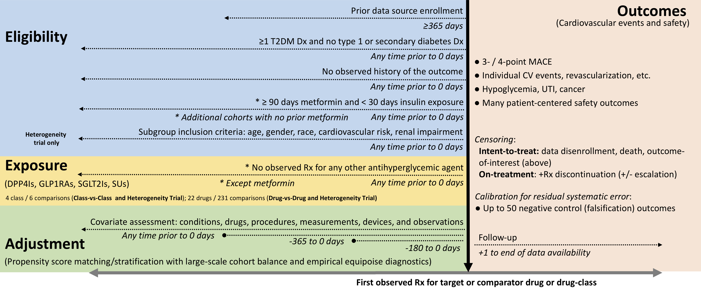

# Rationale and Background

The landscape of therapeutic options for type 2 diabetes mellitus (T2DM) has been dramatically transformed over the last decade [@Lo2018-ca].
The emergence of drugs targeting the sodium-glucose co-transporter-2 (SGLT2) and the glucagon-like peptide-1 (GLP1) receptor has expanded the role of T2DM agents from lowering blood glucose to directly reducing cardiovascular risk [@North2019-xn].
A series of large randomized clinical trials designed to evaluate the cardiovascular safety of SGLT2 inhibitors and GLP1 receptor agonists found that use of many of these agents led to a reduction in major adverse cardiovascular events, including myocardial infarction, hospitalization for heart failure, and cardiovascular mortality [@Zinman2015-ps; @Neal2017-gs; @Marso2016-zg; @Marso2016-yk].
However, other T2DM drugs widely used before the introduction of these novel agents, such as sulfonylureas, did not undergo similarly comprehensive trials to evaluate their cardiovascular efficacy or safety.
The effectiveness and safety of these agents can vary by subgroups like age, sex, and race, which limits the assessment that may guide individual patients’ treatment. Being able to tailor treatments to patients may inform clinical practice and improve outcomes.
The lack of knowledge of the best context for each agent provides an opportunity for systematic, large-scale observational studies.

# Study Objectives

To inform critical decisions facing patients with diabetes, their caregivers, clinicians, policymakers and healthcare system leaders, we have launched the Large-Scale Evidence Generation and Evaluation across a Network of Databases for Diabetes (LEGEND-T2DM) initiative to execute a series of comprehensive observational studies to compare cardiovascular outcome rates and safety of T2DM glucose-lowering agents. Specifically, these studies aim

1. To determine, through systematic evaluation, the comparative effectiveness and safety of T2DM agents, including biguanides, SGLT2 inhibitors, GLP1 receptor agonists, DPP4 inhibitors, and sulfonylureas among patients with T2DM.
2. To assess heterogeneity in effectiveness and safety of T2DM agents among key patient subgroups: Using stratified patient cohorts, we will quantify differential effectiveness and safety across subgroups of patients based on age, sex, race, renal impairment, and baseline cardiovascular risk.

# Research Methods

LEGEND-T2DM will execute systematic, large-scale observational studies of T2DM agents to estimate the relative risks of cardiovascular effectiveness and safety outcomes.

This **Heterogeneity Study** at the class and individual-drug level for T2DM patients for important subgroups.

In contrast to a single comparison approach, LEGEND-T2DM will provide a comprehensive view of the findings and their consistency across populations, drugs, and outcomes.
We will model each study on our successful collaborative research evaluating the comparative effectiveness of antihypertensives recently published in _The Lancet_ [@Suchard2019-gq].

Table \@ref(tab:drug-table) list the four major T2DM agent classes and the individual agents licensed in the U.S. within each class.
We will examine all ${9 \choose 2} = 36$ class-wise comparisons across different patient subgroups. 

For each comparison, we are interested in the relative risk of each of the cardiovascular and safety outcomes described in Section \@ref(outcomes).
<!-- listed in Table \@ref(tab:outcome-table). -->

<!-- Acute pancreatitis -->
<!-- Cancer -->
<!--             Bladder -->
<!--             Renal -->
<!--             Breast -->
<!-- Photosensitivity -->
<!-- DKA -->
<!-- Amputation -->
<!-- Fracture: -->
<!--             All -->
<!--             Fracture-related -->
<!-- VTE -->
<!-- Infection of male genitalia -->
<!-- Hypovolemia or dehydration -->
<!-- Hepatic injury -->
<!-- Hyperkalemia -->
<!-- Mycotic genital infection (women) -->
<!-- Severe hypersensitivity -->
<!-- ?cutaneous reaction -->
<!-- Progression of albuminuria (an efficacy outcome based on labs other than renal function) -->

```{r drug-table, echo=FALSE}
exposures <- read.csv(system.file("settings/ExposuresOfInterest.csv", package = "LegendT2dm"))
classes <- exposures %>% filter(type == "Drug") %>% select(class) %>% pull() %>% unique()
tmp <- sapply(classes, function(single_class) {
  as.vector(exposures %>% filter(type == "Drug", class == single_class) %>% select(name) %>% pull())
})

n.obs <- sapply(tmp, length)
seq.max <- seq_len(max(n.obs))
drugs_by_class <- data.frame(sapply(tmp, "[", i = seq.max))
names(drugs_by_class) <- c("DPP4 inhibitors", "GLP1 receptor antagonists", "SGLT2 inhibitors", "Sulfonylureas")

tab <- kable(drugs_by_class, booktabs = TRUE, linesep = "",
             caption = "T2DM drug classes and individual agents within each class") %>%
  kable_styling(bootstrap_options = "striped", latex_options = c("striped","hold_position"))

if (knitr::is_latex_output()) {
  tab %>%
    column_spec(1, width = "8em") %>%
    column_spec(2, width = "8em") %>%
    column_spec(3, width = "8em") %>%
    column_spec(4, width = "8em") %>%
    kable_styling(font_size = latex_table_font_size)
} else {
  tab
}
```

In addition to the drugs listed in Table \@ref(tab:drug-table), we will also consider the sub-group stratifications listed in Table \@ref(tab:subgroups-table). We will calculate the relative risk of each of the cardiovascular and safety outcomes described in Section \@ref(outcomes), but additionally stratify the relative risks of the outcomes using the subgroups described below.

```{r subgroups-table, echo=FALSE}
subgroups <- read.csv(system.file("settings/SubgroupsOfInterest.csv",
                                 package = "LegendT2dm")) 

tab <- kable(
  subgroups,
  booktabs = TRUE,
  linesep = "",
  caption = "Subgroup definitions used for stratified analysis",
  col.names = c("Subgroup Name", "Brief Description")
) %>%
  kable_styling(
    bootstrap_options = "striped",
    latex_options = c("striped", "hold_position")
  )

if (knitr::is_latex_output()) {
  tab %>%
    column_spec(1, width = "12em") %>%
    column_spec(2, width = "35em") %>%
    kable_styling(font_size = 9)
} else {
  tab
}
```

## Study Design

For each study, we will employ an active comparator, new-user cohort design [@Yoshida2015-ln; @Ryan2013-wq; @Schuemie2020-wx].
New-user cohort design is advocated as the primary design to be considered for comparative effectiveness and drug safety [@Schneeweiss2010-my; @Gagne2012-at; @Johnson2013-db].
By identifying patients who start a new treatment course and using therapy initiation as the start of follow-up, the new-user design models an randomized controlled trial (RCT) where treatment commences at the index study visit.
Exploiting such an index date allows a clear separation of baseline patient characteristics that occur prior to index date and are usable as covariates in the analysis without concern of inadvertently introducing mediator variables that arise between exposure and outcome [@Schneeweiss2007-am].
Excluding prevalent users as those without a sufficient washout period prior to first exposure occurrence further reduces bias due to balancing mediators on the causal pathway, time-varying hazards, and depletion of susceptibles [@Johnson2013-db; @Suissa2017-lv].
Our systematic framework across studies further will address residual confounding, publication bias, and p-hacking using data-driven, large-scale propensity adjustment for measured confounding [@Tian2018-xy], a large set of negative control outcome experiments to address unmeasured and systematic bias
[@Schuemie2014-bv; @Schuemie2016-km; @Schuemie2018-hq], and full disclosure of hypotheses tested [@Schuemie2018-zi].
Figure \@ref(fig:study-schematic) illustrates our design for all studies that the following sections describe in more detail.

```{r study-schematic, echo=FALSE, message=FALSE, fig.align='center', fig.cap='Schematic of LEGEND-T2DM new-user cohort design for the Class-vs-Class, Drug-vs-Drug and Heterogeneity studies.', fig.pos='H'}
if (knitr::is_latex_output()) {
  knitr::include_graphics("StudySchematic.pdf")
} else {
  
}
```

## Data Sources

We will execute LEGEND-T2DM as a series of OHDSI network studies.
All data partners within OHDSI are encouraged to participate voluntarily and can do so conveniently, because of the community's shared Observational Medical Outcomes Partnership (OMOP) common data model (CDM) and OHDSI tool-stack.
Many OHDSI community data partners have already committed to participate and we will recruit further data partners through OHDSI’s standard recruitment process, which includes protocol publication on OHDSI’s GitHub, an announcement in OHDSI’s research forum, presentation at the weekly OHDSI all-hands-on meeting and direct requests to data holders.

Table \@ref(tab:data-sources) lists potential data sources for LEGEND-T2DM; these sources encompass a large variety of practice types and populations.
For each data source, we report a brief description and size of the population it represents and its patient capture process and start date.
While the earliest patient capture begins in 1989 (CUIMC), the vast majority come from the mid-2000s to today, providing almost two decades of T2DM treatment coverage.
US populations include those commercially and publicly insured, enriched for older individuals (MDCR, VA), lower socioeconomic status (MDCD), and racially diverse (VA >20% Black or African American, CUIMC 8%).
The US data sources may capture the same patients across multiple sources.
Different views of the same patients are an advantage in capturing the diversity of real-world health events that patients experience.
Across CCAE (commercially insured), MCDR (Medicare)  and MCDC (Medicaid), we expect little overlap in terms of the same observations recorded at the same time for a patient; patients can flow between sources (e.g., a CCAE patient who retires can opt-in to become an MDCR patient), but the enrollment time periods stand distinct.
On the other hand, Optum, PanTher, OpenClaims, CUIMC and YNHHS may overlap in time with the other US data sources.
While it remains against licensing agreements to attempt to link patients between most data sources, Optum reports <20% overlap between their claims and EHR data sources that is reassuringly small.
All data sources will receive institutional review board approval or exemption for their participation before executing LEGEND-T2DM.

```{r data-sources, echo=FALSE, message=FALSE, warning=FALSE}
data_sources <- readr::read_delim(col_names = TRUE, delim = ";", show_col_types = FALSE, trim_ws = TRUE, file = "
  Data source ; Population ; Patients ; History ; Data capture process and short description
  IBM MarketScan Commercial Claims and Encounters (CCAE) ; Commercially insured, < 65 years ; 142M ; 2000 -- ; Adjudicated health insurance claims (e.g. inpatient, outpatient, and outpatient pharmacy)  from large employers and health plans who provide private healthcare coverage to employees, their spouses and dependents.
  IBM MarketScan Medicare Supplemental Database (MDCR)  ; Commercially insured, 65$+$ years ; 10M ; 2000 -- ; Adjudicated health insurance claims of retirees with primary or Medicare supplemental coverage through privately insured fee-for-service, point-of-service or capitated health plans.
  IBM MarketScan Multi-State Medicaid Database (MDCD) ; Medicaid enrollees, racially diverse ; 26M ; 2006 -- ; Adjudicated health insurance claims for Medicaid enrollees from multiple states and includes hospital discharge diagnoses, outpatient diagnoses and procedures, and outpatient pharmacy claims.
  IQVIA Open Claims (IOC) ; General ; 160M ; 2010 -- ; Pre-adjudicated claims at the anonymized patient-level collected from office-based physicians and specialists via office management software and clearinghouse switch sources for the purpose of reimbursement.
  Japan Medical Data Center (JMDC) ; Japan, general ; 5.5M ; 2005 -- ; Data from 60 society-managed health insurance plans covering workers aged 18 to 65 and their dependents.
  Korea National Health Insurance Service (NHIS) ; 2% random sample of South Korea ; 1M ; 2002 -- ; National administrative claims database covering the South Korean population.
  Optum Clinformatics Data Mart (Optum) ; Commercially or Medicare insured ; 85M ; 2000 -- ; Inpatient and outpatient healthcare insurance claims.
  Columbia University Irving Medical Center (CIUMC) ; Academic medical center patients, racially diverse ; 6M ; 1989 -- ; General practice, specialists and inpatient hospital services from the New York-Presbyterian hospital and affiliated academic physician practices in New York.
  Department of Veterans Affairs (VA) ; Veterans, older, racially diverse ; 12M ; 2000 -- ; National VA health care system, the largest integrated provider of medical services in the US, provided at 170 VA medical centers and 1,063 outpatient sites.
  Information System for Research in Primary Care (SIDIAP) ; 80% of all Catalonia (Spain) ; 7.7M ; 2006 -- ; Primary care partially linked to inpatient data with pharmacy dispensations and primary care laboratories.  Healthcare is universal and taxpayer funded in the region, and PCPs are gatekeeps for all care and responsible for repeat prescriptions.
  IQVIA Disease Analyzer Germany (DAG) ; Germany, general ; 37M ; 1992 -- ; Collection from patient management software used by general practitioners and selected specialists to document patients’ medical records within their office-based practice during a visit.
  Optum Electronic Health Records (OptumEHR) ; US, general ; 93M ; 2006 -- ; Clinical information, prescriptions, lab results, vital signs, body measurements, diagnoses and procedures derived from clinical notes using natural language processing.
  Yale New Haven Health System (YNHHS) ; Academic medical center patients ; 2M ; 2013 -- ; General practice, specialists and inpatient hospital services from the YNHHS in Connecticut.
")
tab <- kable(data_sources, booktabs = TRUE, linesep = "",
      caption = "Committed LEGEND-T2DM data sources and the populations they cover.") %>%
  kable_styling(bootstrap_options = "striped", latex_options = "striped") %>%
  pack_rows("Administrative claims", 1, 7, latex_align = "c", indent = FALSE) %>%
  pack_rows("Electronic health records (EHRs)", 8, 13, latex_align = "c", indent = FALSE)

if (knitr::is_latex_output()) {
  tab %>%
    column_spec(1, width = "10em") %>%
    column_spec(2, width = "10em") %>%
    column_spec(5, width = "25em") %>%
    kable_styling(font_size = latex_table_font_size)
} else {
  tab
}
```

## Study Population

We will include all subjects in a data source who meet inclusion criteria for T2DM agent exposure cohorts.
Broadly, these cohorts will consist of T2DM patients who initiate treatment with one of the drug ingredients that comprise the biguanide, DPP4 inhibitor, GLP1 receptor agonist, SGT2 inhibitor and sulfonylurea drug classes (Table \@ref(tab:drug-table)).
We do not consider thiazolidinediones given their known association with a risk of heart failure and bladder cancer
[@Graham2010-pg; @Turner2014-oq].
We describe specific definitions for exposure cohorts for each study in the following sections.

## Exposure Comparators

### Class-vs-Class Study comparisons {#class-v-class}
The **Class-vs-Class** Study will construct exposure cohorts for new-users of any drug ingredient within the drug classes in Table \@ref(tab:drug-table).
Cohort entry (index date) for each patient is their first observed exposure to any drug ingredient for the  drug classes.
Consistent with an idealized target trial for T2DM therapy and cardiovascular risk [@Hernan2016-ab; @Hernan2019-ie], inclusion criteria for patients based on the index date will include:

* T2DM diagnosis and no Type 1 or secondary diabetes mellitus diagnosis before the index date;
* At least 1 year of observation time before the index date (to improve new-user sensitivity); and
* No prior drug exposure to a comparator or other antihyperglycemic agent (i.e. thiazolidinediones, acarbose, acetohexamide, bromocriptine, glibornuride, miglitol and nateglinide) or $>$ 30 days insulin exposure before index date.

We purposefully do not automatically exclude or restrict to patients with a history of myocardial infarction, stroke or other major cardiovascular events, which will allow us to report relative effectiveness and safety for individuals with both low or moderate and high cardiovascular risk.
Likewise, we do not automatically exclude or restrict to individuals with severe renal impairment [@Nathan2013-cu].
We will use cohort diagnostics, such as achieving covariate balance and clinical empirical equipoise between exposure cohorts (Section \@ref(sample-size)) and stakeholder input to guide the possible need to exclude other prior diagnoses, such as congestive heart failure, pancreatitis or cancer [@Nathan2013-cu].

Appendix \@ref(class-cohort) reports the complete OHDSI `ATLAS` cohort description for new-users of DDP4 inhibitors.
This description lists complete specification of cohort entry events, additional inclusion criteria, cohort exit events, and all associated standard OMOP CDM concept code sets used in the definition.
We generate programmatically equivalent cohort definitions for new-others of each drug class with and without prior metformin use.
`ATLAS` then automatically translates these definitions into network-deployable SQL source code.

Of note, the inclusion criteria do not directly incorporate quantitative measures of poor glycemic control, such as one or more elevated serum HbA1c measurements; such laboratory values are irregularly captured in large claims and even EHR data sources.

For each data source, we will then execute all pairwise class comparisons for which the data source yields $\ge$ 1,000 patients in each arm.
Significantly fewer numbers of patients strongly suggest data source-specific differences in prescribing practices that may introduce residual bias and sufficient samples sizes are required to construct effective propensity score models [@Schuemie_undated-rt, @Suchard2019-gq].

### Drug-vs-Drug Study comparisons {#drug-v-drug}

The **Drug-vs-Drug Study** (if powered) will construct exposure cohorts for new-users of each drug ingredient in Table \@ref(tab:drug-table).
We will apply the same cohort definition, inclusion criteria and patient count minimum as described in Section \@ref(class-v-class).

For each data source, we will then execute all pairwise drug comparisons.
While we will publicly report studies results for all pairwise comparisons, we will focus primary clinical interpretation and scientific publishing to the comparisons that pit drugs within the same class against each other, as well as across-class comparisons that stakeholders deem pertinent given their experiences.

### Heterogeneity Study comparisons

The **Heterogeneity Study**  will  stratify all class- and drug-level exposure cohorts in Sections \@ref(class-v-class) and \@ref(drug-v-drug) by clinically important patient characteristics that modify cardiovascular risk or relative treatment heterogeneity to provide patient-focused treatment recommendations.
These factors will include:

* Age (<21, 21 - 60, >60 at the index date)
* Biological Sex (female / male)
* Race (African American or black)
* Renal impairment (at the index date) as unimpaired, impaired without dialysis, on-dialysis
* Obesity
* Diabetes severity 
* Diabetic Ketoacidosis
* Diabetic Retinopathy 
* Essential Hypertension 
* Hyperlipidemia
* Metabolic dysfunction-associated steatotic liver disease (MASLD)

We will define patients with renal impairment through diagnosis codes for chronic kidney disease and end-stage renal disease, dialysis procedures, and laboratory measurements of estimated glomerular filtration rate, serum creatinine and urine albumin. Obesity will be defined using the WHO definition (BMI >30), body weight >120 kg (or equivalent in pounds), or a diagnosis code for obesity. Poorly controlled diabetes will be defined an HbA1c >8, or a diagnosis code for uncontrolled type 2 diabetes or poor diabetes control. Diabetic ketoacidosis, Diabetic Retinopathy, Essential Hypertension, Hyperlipidemia, and MASLD will be defined based on the presence of relevant diagnosis codes in the patient's medical history.

Appendix \@ref(atlas-subgroups) presents complete OHDSI `ATLAS` specifications for these subgroups, including all standard OMOP CDM concept codes defining cardiovascular risk and renal disease.

### Validation

We will validate exposure cohorts and aggregate drug utilization using comprehensive cohort characterization tools against both claims and EHR data sources.
Chief among these tools stands OHDSI’s `CohortDiagnostic` package ([github](https://ohdsi.github.io/CohortDiagnostics/)).
For any cohort and data source mapped to OMOP CDM, this package systematically generates incidence new-user rates (stratified by age, gender, and calendar year), cohort characteristics (all comorbidities, drug use, procedures, health utilization) and the actual codes found in the data triggering the various rules in the cohort definitions.
This can allow researchers and stakeholders to understand the heterogeneity of source coding for exposures and health outcomes as well as the impact of various inclusion criteria on overall cohort counts (details described in Section \@ref(sample-size)).

## Outcomes {#outcomes}

Across all data sources and pairwise exposure cohorts, we will assess relative risks of 11 cardiovascular and patient-centered outcomes (Table \@ref(tab:outcome-table)).

Cardiovascular outcomes include:
* Acute myocardial infarction,
* acute renal failure,
* hospitalization with heart failure, and
* stroke

Patient-centered safety outcomes include: 
* Acute pancreatitis,
* diabetic ketoacidosis,
* diarrhea,
* vomiting, and
* hepatic failure

We will also study T2DM drug side-effects and safety concerns highlighted in the 2018 ADA guidelines [@American_Diabetes_Association2018-yz] and from RCTs, including:

* abnormal weight change and 
* hypoglycemia.

<!-- While we list many patient-centered outcomes as "exploratory" in the table, we use this term to highlight those that are less likely to achieve high statistical power across all data sources due to lower event rates. -->
We will employ the same level of systematic rigor in studying outcomes regardless of their primary or secondary label.

```{r outcome-prep, echo=FALSE, warning=FALSE}
outcomes <- read.csv(system.file("settings/OutcomesOfInterest.csv",
                                 package = "LegendT2dm")) %>%
  select(atlasName,description,cite,hyperlink)

stripCitation <- function(cite) {
  if (cite != "") {
    tmp <- substring(cite, 2, nchar(cite) - 1)
    citeList <- strsplit(tmp, ";")
    #paste(unlist(citeList), collapse = ";")
    citeList
  } else {
    NULL
  }
}

citeList <- unlist(sapply(outcomes$cite, stripCitation))
names(citeList) <- NULL
citeList <- unique(citeList)

citeList <- paste("[",
                  paste(citeList, collapse = ";")
                  ,"]", collapse = "")

if (knitr::is_latex_output()) {
  convertCitationToLatex <- function(cite) {
    if (cite != "") {
      tmp <- substring(cite, 2, nchar(cite) - 1)
      citeList <- strsplit(tmp, ";")
      tmpList <- lapply(citeList, function(x) {
        substring(x, 2, nchar(x))
      })
      tags <- paste(unlist(tmpList), collapse = ",")
      cite <- paste("\\cite{", tags, "}", sep = "")
    }
    cite
  }
  outcomes$cite <- outcomes$hyperlink
}

outcomes <- outcomes %>% select(-hyperlink)
```

A majority of outcome definitions have been previously implemented and validated in our own work [@Suchard2019-gq; @You_undated-fz; @Ryan2018-ci; @Wang2017-su; @Weinstein2020-ic; @Yuan2018-am] based heavily on prior development by others (see references in Table \@ref(tab:outcome-table) `r citeList`).
To assess across-source consistency and general clinical validity, we will characterize outcome incidence, stratified by age, sex and index year for each data source.

```{r outcome-table, echo=FALSE, warning=FALSE, results='asis'}
colnames(outcomes) <- c("Phenotype", "Brief logical description", "Prior development")

tab <- kable(outcomes, booktabs = TRUE, linesep = "", escape = FALSE,
             longtable = (is.null(params$avoidLongTable) || (params$avoidLongTable == FALSE)),
      caption = "LEGEND-T2DM study outcomes") %>%
  kable_styling(bootstrap_options = "striped", latex_options = "striped") %>%
  pack_rows("Cardiovascular outcomes", 1, 2, latex_align = "c", indent = FALSE)  %>%
  pack_rows("Patient-centered safety outcomes", 11, 12, latex_align = "c", indent = FALSE)

if (knitr::is_latex_output()) {
  tab %>%
    column_spec(2, width = "32em") %>%
    # column_spec(3, width = "10em") %>%
    kable_styling(font_size = latex_table_font_size,
                  latex_options = c("repeat_header"),
                  repeat_header_continued = "\\textit{(Continued on Next Page...)}")
} else {
  tab
}
```

## Analysis

### Contemporary utilization of drug classes and individual agents

For all cohorts in the three studies, we will describe overall utilization as well as temporal trends in the use of each drug class and agents within the class.
Further, we will evaluate these trends in patient groups by age (18-44 / 45-64 / $\ge$ 65 years), gender, race and geographic regions.
Since the emergence of novel medications in the management of type 2 DM in 2014, there has been a rapid expansion in both the number of drug classes and individual agents.
These data will provide insight into the current patterns of use and possible disparities.
These data are critical to guide the real-world application of treatment decision pathways for the treatment of T2DM patients.

Specifically, we will calculate and validate aggregate drug utilization using the OHDSI’s CohortDiagnostic package against both claims and EHR data sources.
The CohortDiagnostics package works in two steps: 1) Generate the utilization results and diagnostics against a data source and 2) Explore the generated utilization and diagnostics in a user-friendly graphical interface R-Shiny app.
Through the interface, one can explore patient profiles of a random sample of subjects in a cohort.
These diagnostics provide a consistent methodology to evaluate cohort definitions/phenotype algorithms across a variety of observational databases.
This will enable researchers and stakeholders to become informed on the appropriateness of including specific data sources within analyses, exposing potential risks related to heterogeneity and variability in patient care delivery that, when not addressed in the design, could result in errors such as highly correlated covariates in propensity score matching of a target and a comparator cohort.
Thus, the added value of this approach is two-fold in terms of exposing data quality for a study question and ensuring face validity checks are performed on proposed covariates to be used for balancing propensity scores.

### Relative risk of cardiovascular and patient-centered outcomes

For all three studies, we will execute a systematic process to estimate the relative risk of cardiovascular and patient-centered outcomes between new-users of second-line T2DM agents.
The process will adjust for measured confounding, control from further residual (unmeasured) bias and accommodate important design choices to best emulate the nearly impossible to execute, idealized RCT that our stakeholders envision across data source populations, comparators, outcomes and subgroups.

To adjust for potential measured confounding and improve the balance between cohorts, we will build large-scale propensity score (PS) models [@Rosenbaum1983-cd] for each pairwise comparison and data source using a consistent data-driven process through regularized regression [@Tian2018-xy].
This process engineers a large set of predefined baseline patient characteristics, including age, gender, race, index month/year and other demographics and prior conditions, drug exposures, procedures, laboratory measurements and health service utilization behaviors, to provide the most accurate prediction of treatment and balance patient cohorts across many characteristics.
Construction of condition, drug, procedures and observations include occurrences within 365, 180 and 30 days prior to index date and are aggregated at several SNOMED (conditions) and ingredient/ATC class (drugs) levels.
Other demographic measures include comorbidity risk scores (Charlson, DCSI, CHADS2, CHAD2VASc).
From prior work, feature counts have ranged in the 1,000s - 10,000s, and these large-scale PS models have outperformed hdPS [@Schneeweiss2009-im] in simulation and real-world examples [@Tian2018-xy].
Given the subcutaneous route of administration of GLP1RAs compared with other drugs administered orally, device codes that represent needles and associated health management encounters, will be excluded from propensity score construction.

We will:

* Exclude patients who have experienced the outcome prior to their index date,
* Stratify and 1-to-1 match patients by PS, and
* Use Cox proportional hazards models

to estimate hazard ratios (HRs) between alternative target and comparator treatments for the risk of each outcome in each data source.
In addition, we will perform a sensitivity analysis that does not exclude individuals who previously experienced a glycemic control outcome before the index date.
The regression will condition on the PS strata/matching-unit with treatment allocation as the sole explanatory variable and censor patients at the end of their time-at-risk (TAR) or data source observation period.
We will prefer stratification over matching if both sufficiently balance patients (see Section \@ref(sample-size)), as the former optimizes patient inclusions and thus generalizability.

We will execute each comparison using three different TAR definitions, reflecting different and important causal contrasts:

* Intent-to-treat (TAR: index + 1 → end of observation) captures both direct treatment effects and (long-term) behavioral/treatment changes that initial assignment triggers [@Hernan2012-kz];
* On-treatment-1 (TAR: index + 1 → treatment discontinuation) is more patient-centered [@Murray2018-zf] and captures direct treatment effect while allowing for escalation with additional T2DM agents; and
* On-treatment-2 (TAR: index + 1 → discontinuation or escalation with T2DM agents) carries the least possible confounding with other concurrent T2DM agents.

Our "on-treatment" is often called "per-protocol" [@Hernan2017-qp].
Systematically executing with multiple causal contrasts enables us to identify potential biases that missing prescription data, treatment escalation and behavioral changes introduce, while preserving the ease of intent-to-treat interpretation and power if the data demonstrate them as unbiased.
Appendix \@ref(escalation-cohort) reports the modified cohort exit rule for the on-treatment-2 TAR.

We will aggregate HR estimates across non-overlapping data sources to produce meta-analytic estimates using a random-effects meta-analysis [@DerSimonian1986-co].
This classic meta-analysis assumes that per-data source likelihoods are approximately normally distributed [@Gronsbell2020-sr].
This assumption fails when outcomes are rare as we expect for some safety events.
Here, our recent research shows that as the number of data sources increases, the non-normality effect increases to where coverage of 95% confidence intervals (CIs) can be as low as 5%.
To counter this, we will also apply a Bayesian meta-analysis model [@Higgins2009-cm; @schuemie2021combining] that neither assumes normality nor requires patient-level data sharing by building on composite likelihood methods [@Varin2011-gc] and enables us to introduce appropriate overlap weights between data sources.

Residual study bias from unmeasured and systematic sources often remains in observational studies even after controlling for measured confounding through PS-adjustment [@Schuemie2014-bv; @Schuemie2016-km].
For each comparison-outcome effect, we will conduct negative control (falsification) outcome experiments, where the null hypothesis of no effect is believed to be true, using
approximately 100 controls.
We identified these controls through a data-rich algorithm [@Voss2017-nv] that identifies prevalent OMOP condition concept occurrences that lack evidence of association with exposures in published literature, drug-product labeling and spontaneous reports, and were then adjudicated by clinical review.
We previously validated 60 of the controls in LEGEND-HTN [@Suchard2019-gq].
Appendix \@ref(negative-controls) lists these negative controls and their OMOP condition concept IDs.

Using the empirical null distributions from these experiments, we will calibrate each study effect HR estimate, its 95% CI and the $p$-value to reject the null hypothesis of no differential effect [@Schuemie2018-hq].
We will declare an HR as significantly different from no effect when its calibrated $p < 0.05$ without correcting for multiple testing.
Finally, blinded to all trial results, study investigators will evaluate study diagnostics for all comparisons to assess if they were likely to yield unbiased estimates (Section \@ref(sample-size)).

### Subgroup effects

We will calculate subgroup effects in two ways. First, we will calculate the difference in the hazard ratios of different subgroups for each outcome for pairs of classes (or drugs), and we will calculate the statistical significance of that difference. 
Second, for the 1-to-1 matching comparisons, we will more directly compare incidence rates between subgroups for each outcome for pairs of classes (or drugs). This latter comparison may have more power than comparing hazard ratios.


# Sample Size and Study Power {#sample-size}

Within each data source, we will execute all comparisons with $\ge$ 1,000 eligible patients per arm.
Blinded to effect estimates, investigators and stakeholders will evaluate extensive study diagnostics for each comparison to assess reliability and generalizability, and only report risk estimates that pass [@Schuemie2018-zi; @Schuemie2020-wx].
These diagnostics will include

1. Minimum detectable risk ratio (MDRR) as a typical proxy for power,
2. Preference score distributions to evaluate empirical equipoise10 and population generalizability,
3. Extensive patient characteristics to evaluate cohort balance before and after PS-adjustment,
4. Negative control calibration plots to assess residual bias, and
5. Kaplan-Meier plots to examine hazard ratio proportionality assumptions.

We will define cohorts to stand in empirical equipoise if the majority of patients carry preference scores between 0.3 and 0.7 and to achieve balance if all after-adjustment characteristics return absolute standardized mean differences $<$ 0.1 [@Austin2009-af].

# Strengths and Limitations {#strengths-limitations}

## Strengths

LEGEND-T2DM is, to our knowledge, the largest and most comprehensive study to provide evidence about the comparative effectiveness and safety of T2DM agents in subgroups.
The LEGEND-T2DM studies will encompass over 1 million patients initiating T2DM agents across at least databases from several countries and will examine all pairwise comparisons between the drug classes against a panel of TODO health outcomes.
Through an international network, LEGEND-T2DM seeks to take advantage of disparate health databases drawn from different sources and across a range of countries and practice settings.
These large-scale and unfiltered populations better represent real-world practice than the restricted study populations in prescribed treatment and follow-up settings from RCTs.
Our use of the OMOP CDM allows extension of the LEGEND-T2DM experiment to future databases and allows replication of these results on licensable databases that were used in this experiment, while still maintaining patient privacy on patient-level data.

LEGEND-T2DM further advances the statistically rigorous and empirically validated methods we have developed in OHDSI that specifically address bias inherent in observational studies and allow for reliable causal inference.
Patient characteristics and their treatment choices are likely to confound comparative effectiveness and safety estimates.
Our approach combines active comparator new-user designs that emulate randomized clinical trials with large-scale propensity adjustment for measured confounding, a large set of negative control outcome experiments to address unmeasured and systematic bias, and full disclosure of hypotheses tested.

Each LEGEND-T2DM aim will represent evidence synthesis from a large number of bespoke studies across multiple data sources.
Addressing questions one bespoke study at a time is prone to errors arising from multiple testing, random variation in effect estimates and publication bias.
LEGEND-T2DM is designed to avoid these concerns through methodologic best practices [@Schuemie_undated-mx] with full study diagnostics and external replication.

Through open science, LEGEND-T2DM will allow any interested investigators to engage as partners in our work at many levels.
We will publicly develop all protocols and analytic code.
This invites additional data custodians to participate in LEGEND-T2DM and enables others to modify and reuse our approach for other investigations.
We will also host real-time access to all study result artifacts for outside analysis and interpretation.
Such an open science framework ensures a feed-forward effect on other scientific contributions in the community.
Collectively, LEGEND-T2DM will generate patient-centered, high quality, generalizable evidence that will transform the clinical management of T2DM through our active collaboration with patients, clinicians, and national medical societies.
LEGEND-T2DM will spur scientific innovation through the generation of open-source resources in data science.

## Limitations

Even though many potential confounders will be included in these studies, there may be residual bias due to unmeasured or misspecified confounders, such as confounding by indication, differences in physician characteristics that may be associated with drug choice, concomitant use of other drugs started after the index date, and informative censoring at the end of the on-treatment periods.
To minimize this risk, we will use methods to detect residual bias through a large number of negative and positive controls.

Ideal negative controls carry identical confounding between exposures and the outcome of interest [@Lipsitch2010-oj].
The true confounding structure, however, is unknowable.
Instead of attempting to find the elusive perfect negative control, we will rely on a large sample of controls that represent a wide range of confounding structures.
If a study comparison proves to be unbiased for all negative controls, we can feel confident that it will also be unbiased for the outcome of interest.
In our previous studies [@Suchard2019-gq; @Hripcsak2020-gz; @Schuemie2020-wx], using the active comparator, new-user cohort design we will employ here, we have observed minimal residual bias using negative controls.
This stands in stark contrast to other designs such as the (nested) case-control that tends to show large residual bias because of incomparable exposure cohorts implied by the design [@Schuemie2019-ay].

Observed follow-up times are limited and variable, potentially reducing power to detect differences in effectiveness and safety and, further, misclassification of study variables is unavoidable in secondary use of health data, so it is possible to misclassify treatments, covariates, and outcomes.
Based on our previous successful studies on antihypertensives, we do not expect differential misclassification, and therefore bias will most likely be towards the null.
Finally, the electronic health record databases may be missing care episodes for patients due to care outside the respective health systems.
Such bias, however, will also most likely be towards the null.

# Protection of Human Subjects

LEGEND-T2DM does not involve human subjects research.
The project does, however, use human data collected during routine healthcare provision.
Most often the data are de-identified within data source.
All data partners executing the LEGEND-T2DM studies within their data sources will have received institutional review board (IRB) approval or waiver for participation in accordance to their institutional governance prior to execution (see Table \@ref(tab:irb)).
LEGEND-T2DM executes across a federated and distributed data network, where analysis code is sent to participating data partners and only aggregate summary statistics are returned, with no sharing of patient-level data between organizations.

```{r irb, echo=FALSE, message=FALSE, warning=FALSE}
data_sources <- readr::read_delim(col_names = TRUE, delim = "&", trim_ws = TRUE, file = "
Data source & Statement
IBM MarketScan Commercial Claims and Encounters (CCAE) & New England Institutional Review Board and was determined to be exempt from broad IRB approval, as this research project did not involve human subject research.
IBM MarketScan Medicare Supplemental Database (MDCR)  & New England Institutional Review Board and was determined to be exempt from broad IRB approval, as this research project did not involve human subject research.
IBM MarketScan Multi-State Medicaid Database (MDCD) & New England Institutional Review Board and was determined to be exempt from broad IRB approval, as this research project did not involve human subject research.
IQVIA Open Claims (IOC) & This is a retrospective database study on de-identified data and is deemed not human subject research. Approval is provided for OHDSI network studies.
Japan Medical Data Center (JMDC) & New England Institutional Review Board and was determined to be exempt from broad IRB approval, as this research project did not involve human subject research.
Korea National Health Insurance Service (NHIS) & Ajou University Institutional Review Board (AJIRB-MED-EXP-17-054 for LEGEND-HTN) and approval expected shortly for LEGEND-T2DM.
Optum Clinformatics Data Mart (Optum) & New England Institutional Review Board and was determined to be exempt from broad IRB approval, as this research project did not involve human subject research.
Columbia University Irving Medical Center (CIUMC) & Use of the CUIMC data source was approved by the Columbia University Institutional Review Board as an OHDSI network study (IRB\\# AAAO7805).
Department of Veterans Affairs (VA) & Use of the VA-OMOP data source was reviewed by the Department of Veterans Affairs Central Institutional Review Board (IRB) and was determined to meet the criteria for exemption under Exemption Category 4(3) and approved the request for Waiver of HIPAA Authorization.
Information System for Research in Primary Care (SIDIAP) & Use of the SIDIAP data source was approved by the Clinical Research Ethics Committee of IDIAPJGol (project code: 20/070-PCV)
IQVIA Disease Analyzer Germany (DAG) & This is a retrospective database study on de-identified data and is deemed not human subject research. Approval is provided for OHDSI network studies.
Optum Electronic Health Records (OptumEHR) & New England Institutional Review Board and was determined to be exempt from broad IRB approval, as this research project did not involve human subject research.
Yale New Haven Health System (YNHHS) & Use of the YNHHS EHR data source was approved by the Yale University Institutional Review Board as an OHDSI network study (IRB\\# pending).
")

tab <- kable(data_sources, booktabs = TRUE, linesep = "",
      caption = "IRB approval or waiver statement from partners.") %>%
  kable_styling(bootstrap_options = "striped", latex_options = "striped")

if (knitr::is_latex_output()) {
  tab %>%
    column_spec(1, width = "15em") %>%
    column_spec(2, width = "40em") %>%
    kable_styling(latex_options = c("striped","hold_position"), 
                  font_size = latex_table_font_size)
} else {
  tab
}
```

# Management and Reporting of Adverse Events and Adverse Reactions

LEGEND-T2DM uses coded data that already exist in electronic databases.
In these types of databases, it is not usually possible to link (i.e., identify a potential causal association between) a particular product and medical event for any specific individual.
Thus, the minimum criteria for reporting an adverse event (i.e., identifiable patient, identifiable reporter, a suspect product and event) are not available and adverse events are not reportable as individual adverse event reports.
The study results will be assessed for medically important findings.

# Plans for Disseminating and Communicating Study Results

Open science aims to make scientific research, including its data process and software, and its dissemination, through publication and presentation, accessible to all levels of an inquiring society, amateur or professional [@Woelfle2011-ss] and is a governing principle of LEGEND-T2DM.
Open science delivers reproducible, transparent and reliable evidence.
All aspects (except private patient data) will be open and we will actively encourage other interested researchers, clinicians and patients to participate.
This differs fundamentally from traditional studies that rarely open their analytic tools or share all result artifacts, and inform the community about hard-to-verify conclusions at completion.

## Transparent and re-usable research tools

We will publicly register this protocol and announce its availability for feedback from stakeholders, the OHDSI community and within clinical professional societies.
This protocol will link to open source code for all steps to generating diagnostics, effect estimates, figures and tables.
Such transparency is possible because we will construct our studies on top of the OHDSI toolstack of open source software tools that are community developed and rigorously tested [@Schuemie2020-wx].

## Continuous sharing of results

LEGEND-T2DM embodies a new approach to generating evidence from healthcare data that overcome weaknesses in the current process of answering and publishing (or not) one question at a time.
Generating evidence for thousands of research and control questions using a systematic process enables us to not only evaluate that process and the coherence and consistency of the evidence, but also to avoid $p$-hacking and publication bias [@Schuemie2018-zi].
We will store and openly communicate all of these results as they become available using a user-friendly web-based app that serves up all descriptive statistics, study diagnostics and effect estimates for each cohort comparison and outcome.
Open access to this app will be through a general public facing LEGEND-T2DM webpage.

## Scientific meetings and publications

We will deliver multiple presentations annually at scientific venues including the annual meetings of the American Diabetes Association, American College of Cardiology, American Heart Association and American Medical Informatics Association.
We will also prepare multiple scientific publications for clinical, informatics and statistical journals.

## General public

We believe in sharing our findings that will guide clinical care with the general public.
LEGEND-T2DM will use social-media (Twitter) to facilitate this.
With dedicated support from the OHDSI communications specialist, we will deliver regular press releases at key project stages, distributed via the extensive media networks of UCLA, Columbia and Yale.
